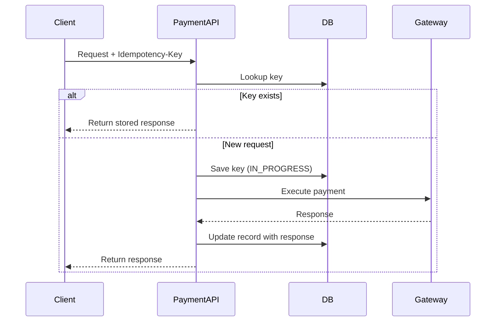

## 1. Why Storage & Handling Matter

---

Idempotency keys alone are not enough.

> 📝 **Key Insight:**  
> The system must **persist and reuse prior outcomes** to make retries safe.

Without proper storage and handling:

- duplicate requests will still create side effects
- retries may trigger multiple gateway calls
- responses may become inconsistent

---

## 2. What Do We Need to Store?

---

For each idempotency key, we should persist:

| Field             | Purpose                       |
| ----------------- | ----------------------------- |
| `idempotencyKey`  | identify duplicate requests   |
| `requestHash`     | ensure request consistency    |
| `paymentId`       | link to created payment       |
| `responsePayload` | return same response on retry |
| `status`          | track processing state        |
| `createdAt`       | lifecycle tracking            |
| `expiresAt`       | TTL handling                  |

---

### Why Store Response?

So that:

- repeated requests can return **exact same output**
- client sees consistent behavior

---

## 3. Storage Options

---

### Option 1: Database (Recommended)

- durable
- consistent
- easy to query

👉 Best for payment systems where correctness matters

---

### Option 2: Cache (e.g., Redis)

- fast lookup
- supports TTL naturally

❌ Risk:

- data loss on eviction

---

### Best Practice

👉 Use **DB as source of truth**  
👉 Optionally add **cache for performance**

---

## 4. Handling Flow (Core Logic)

---



---

## 5. Handling In-Progress Requests (Important)

---

What if:

- first request is still processing
- second request arrives with same key

---

### Possible Approaches

#### Option 1: Reject Second Request

- return `409 Conflict` or similar

#### Option 2: Wait / Poll (Advanced)

- block until first request completes

#### Option 3: Return "Processing" State (Recommended)

- indicate request is already in progress

---

## 6. Request Consistency Check

---

When the same key is reused:

👉 we must ensure the request is identical

---

### How?

- hash the request body
- compare with stored hash

---

### If mismatch

```json
{
  "error": {
    "code": "IDEMPOTENCY_KEY_REUSE",
    "message": "Request does not match original"
  }
}
```

---

## 7. Handling Failures Safely

---

### Scenario 1: Gateway success, API crashes

- response not returned to client
- retry arrives

👉 Solution:

- stored response ensures correct replay

---

### Scenario 2: Gateway timeout

- unknown result

👉 Solution:

- mark as `PROCESSING`
- retry logic or reconciliation required

---

## 8. Status Field Design

---

Typical states for idempotency record:

- `IN_PROGRESS`
- `COMPLETED`
- `FAILED`

---

### Why needed?

- handle concurrent requests
- manage partial failures

---

## 9. TTL & Cleanup Strategy

---

Idempotency records should not live forever.

---

### Strategy

- store for 24–48 hours
- delete or archive after expiry

---

### Trade-off

| Longer TTL    | Shorter TTL                        |
| ------------- | ---------------------------------- |
| safer retries | less storage                       |
| more cost     | higher duplicate risk after expiry |

---

## 10. Common Mistakes to Avoid

---

### ❌ Not storing response

- cannot replay results

---

### ❌ No request validation

- allows incorrect reuse

---

### ❌ Ignoring in-progress state

- leads to race conditions

---

### ❌ Using cache only

- risk of data loss

---

## Conclusion

---

Idempotency storage and handling turn a simple concept into a **robust mechanism**.

A correct implementation:

- prevents duplicate execution
- ensures consistent responses
- handles failures safely

---

### 🔗 What’s Next?

👉 **[Handling Duplicate Create Requests →](/learning/advanced-skills/system-design-practice/intermediate-systems/6_payment-api/5_phase-5/5_4_handling-duplicate-create-requests/)**

---

> 📝 **Takeaway**:
>
> - Store idempotency keys with request and response
> - Always return stored response for retries
> - Handle in-progress and failure states carefully
