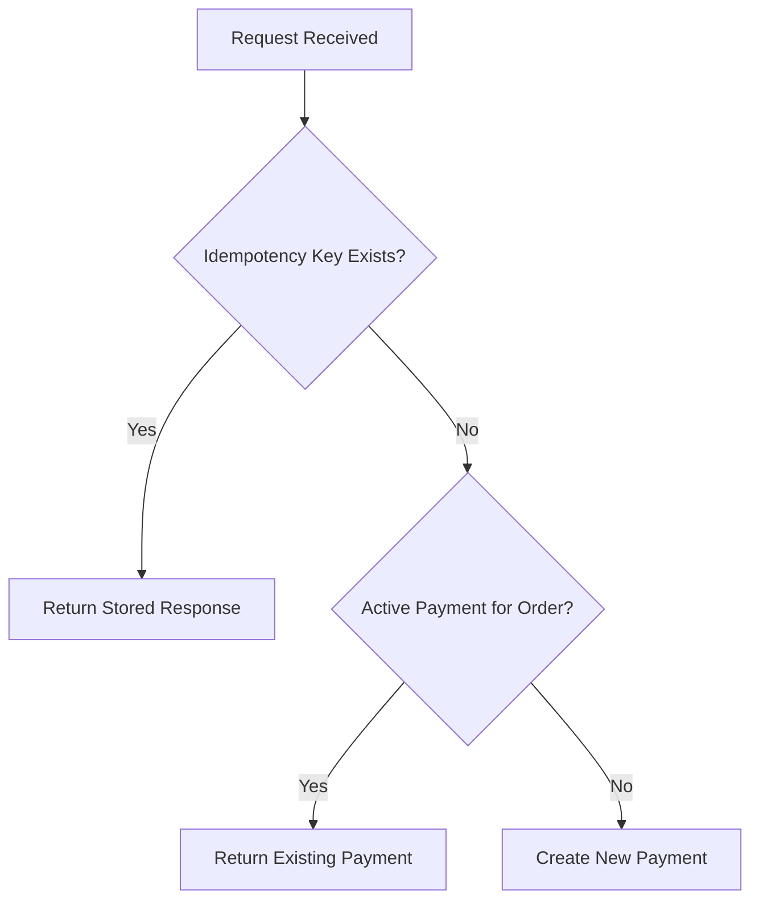

## 1. Why Duplicate Create Requests Are a Problem

---

When a client calls:

```java
POST /payments
```

there is a risk that the same request is sent multiple times due to:

- user double-clicking the payment button
- frontend retrying after timeout
- network failures causing lost responses

👉 This can result in **multiple payment records for the same logical payment**.

---

## 2. Example Problem Scenario

---

```text
User clicks "Pay"
→ Request sent
→ Response lost
→ Client retries
```

Without protection:

```text
Request 1 → pay_001 created
Request 2 → pay_002 created
```

👉 Now the system has two payments for one order.

---

## 3. Two Types of Duplicate Problems

---

### 1. Same Request Retried

- identical request sent multiple times
- same payload, same intent

👉 Solution: **Idempotency Key**

---

### 2. Same Business Intent, Different Requests

- client generates new idempotency key each time
- same `orderId`, different request IDs

👉 Solution: **Business-Level Validation**

---

## 4. Solution 1 — Idempotency for Create API

---

Client sends:

```java
POST /payments
Idempotency-Key: abc-123
```

---

### Behavior

- first request → create payment
- repeated request → return same payment

---

### Example

```text
Request 1 → creates pay_001
Request 2 → returns pay_001
```

👉 Prevents duplicate entries for the same request.

---

## 5. Solution 2 — Business Constraint (Order-Level)

---

Even with idempotency, this can still happen:

```text
Same orderId
Different idempotency keys
```

---

### Example

```text
Request 1 → orderId = ORD-123 → pay_001
Request 2 → orderId = ORD-123 → pay_002
```

👉 This is a different problem.

---

### Solution Options

#### Option 1: Allow Multiple Payments (Flexible)

- multiple attempts allowed
- useful for retrying failed payments

---

#### Option 2: Allow Only One Active Payment (Recommended)

- only one payment in `CREATED` or `PROCESSING` state
- reject or return existing payment

---

### Example Behavior

```text
If active payment exists for order:
→ return existing payment
OR
→ reject new request
```

---

## 6. Combined Approach (Best Practice)

---

To fully protect the system, combine both:

### 1. Idempotency Key

- protects against request-level duplication

### 2. Business Constraint

- protects against logical duplication

---

### Flow



---

## 7. Edge Cases to Consider

---

### Case 1: Payment Failed Earlier

- user retries payment

👉 Should allow new payment creation

---

### Case 2: Payment in Processing State

- ongoing gateway call

👉 Should NOT create new payment

---

### Case 3: Idempotency Key Expired

- request arrives after TTL

👉 treat as new request

---

## 8. Implementation Considerations

---

### Database Constraints

- unique index on `(orderId, activeState)` (optional)

---

### Validation Layer

- check idempotency first
- then check business rules

---

### Response Strategy

- return existing payment when possible
- avoid hard failures unless necessary

---

## 9. Common Mistakes to Avoid

---

### ❌ Only using idempotency

- does not prevent logical duplicates

---

### ❌ Only using business constraint

- does not handle retries correctly

---

### ❌ Creating payment before validation

- leads to inconsistent state

---

## Conclusion

---

Handling duplicate create requests requires both:

- request-level protection (idempotency)
- business-level validation (order constraints)

This ensures:

- no duplicate payment records
- safe retry handling
- consistent system state

---

### 🔗 What’s Next?

👉 **[Handling Duplicate Confirm Requests →](/learning/advanced-skills/system-design-practice/intermediate-systems/6_payment-api/5_phase-5/5_5_handling-duplicate-confirm-requests/)**

---

> 📝 **Takeaway**:
>
> - Duplicate create requests are common in real systems
> - Idempotency alone is not enough
> - Combine idempotency with business rules for full protection
