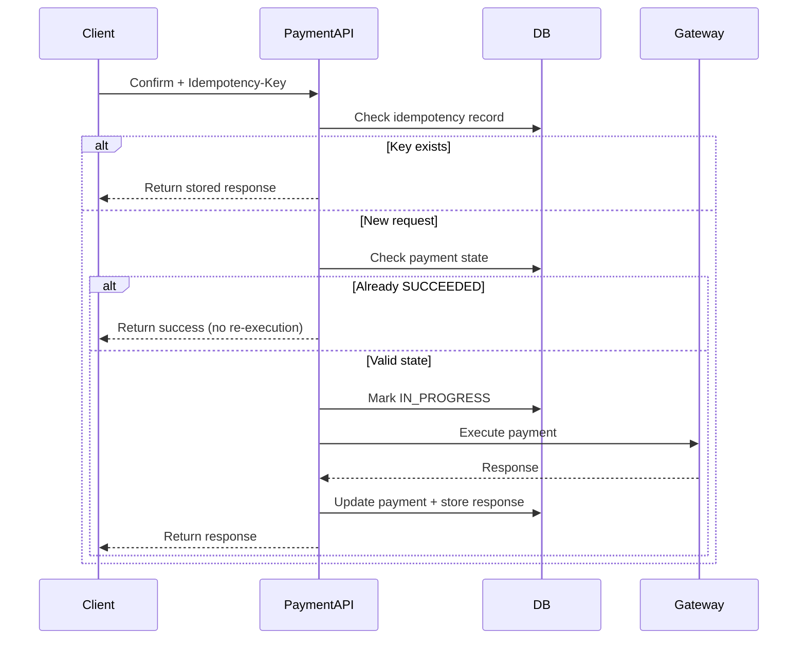

## 1. Why Duplicate Confirm Requests Are Dangerous

---

When a client calls:

```java
POST /payments/{paymentId}/confirm
```

there is a risk that the same request is sent multiple times due to:

- client retries after timeout
- network failures
- user clicking confirm multiple times

👉 Unlike create requests, duplicate confirm requests can lead to **multiple actual charges**.

> ❗ This is one of the most critical problems in payment system design.

---

## 2. Example Failure Scenario

---

```text
Client sends confirm request
→ Gateway processes payment successfully
→ API crashes before responding
→ Client retries confirm
```

Without protection:

```text
Request 1 → Charge executed
Request 2 → Charge executed again ❌
```

👉 The user gets charged twice.

---

## 3. Why Idempotency Alone is Not Enough

---

Idempotency helps detect duplicate requests.

But confirm operations also involve:

- external gateway calls
- state transitions
- concurrency risks

👉 So we need **multiple layers of protection**.

---

## 4. Core Protection Mechanisms

---

To safely handle duplicate confirm requests, we must combine:

### 1. Idempotency Key

- detect repeated requests

---

### 2. Payment State Validation

- ensure confirm is allowed only in valid states

---

### 3. Concurrency Control

- prevent parallel execution

---

### 4. Gateway Idempotency (Optional but Strong)

- some gateways also support idempotency keys

---

## 5. Correct Handling Flow

---



---

## 6. Payment State Protection

---

### Rule

Confirm should only be allowed when:

- `CREATED`
- or retryable `FAILED`

---

### Reject Cases

- `SUCCEEDED` → already completed
- `PROCESSING` → in progress

---

### Example

```json
{
  "error": {
    "code": "INVALID_STATE",
    "message": "Payment cannot be confirmed in current state"
  }
}
```

---

## 7. Handling Concurrent Confirm Requests

---

### Problem

Two confirm requests arrive at the same time:

```text
Thread A → confirm
Thread B → confirm
```

Without protection:

- both may call gateway

---

### Solution Options

#### Option 1: DB Locking (Recommended)

- lock payment row (`SELECT ... FOR UPDATE`)
- ensure only one thread proceeds

---

#### Option 2: Optimistic Locking

- version-based control

---

#### Option 3: In-Progress Flag

- mark payment as `PROCESSING`
- reject other requests

---

## 8. Gateway-Level Protection (Advanced)

---

Some payment gateways (e.g., Stripe) support idempotency.

👉 You can send the same idempotency key to the gateway.

---

### Benefit

- prevents duplicate charges even if API fails

---

### Best Practice

- combine **API-level + gateway-level idempotency**

---

## 9. Handling Partial Failures

---

### Scenario 1: Gateway success, API crash

- retry arrives

👉 Solution:

- use stored response
- return success without re-execution

---

### Scenario 2: Gateway timeout

- result unknown

👉 Solution:

- mark as `PROCESSING`
- retry or reconcile later

---

## 10. Common Mistakes to Avoid

---

### ❌ No idempotency on confirm

- leads to duplicate charges

---

### ❌ Not validating payment state

- allows invalid transitions

---

### ❌ No concurrency control

- race conditions cause multiple executions

---

### ❌ Trusting gateway blindly

- system may become inconsistent

---

## Conclusion

---

Handling duplicate confirm requests is critical because it directly affects **money movement**.

A correct design ensures:

- payment is executed at most once
- retries are safe
- system remains consistent under failure

---

### 🔗 What’s Next?

👉 **[Failure Scenarios & Edge Cases →](/learning/advanced-skills/system-design-practice/intermediate-systems/6_payment-api/5_phase-5/5_6_failure-scenarios-and-edge-cases/)**

---

> 📝 **Takeaway**:
>
> - Duplicate confirm requests can cause duplicate charges
> - Use idempotency + state checks + concurrency control
> - Combine API-level and gateway-level protection for safety
