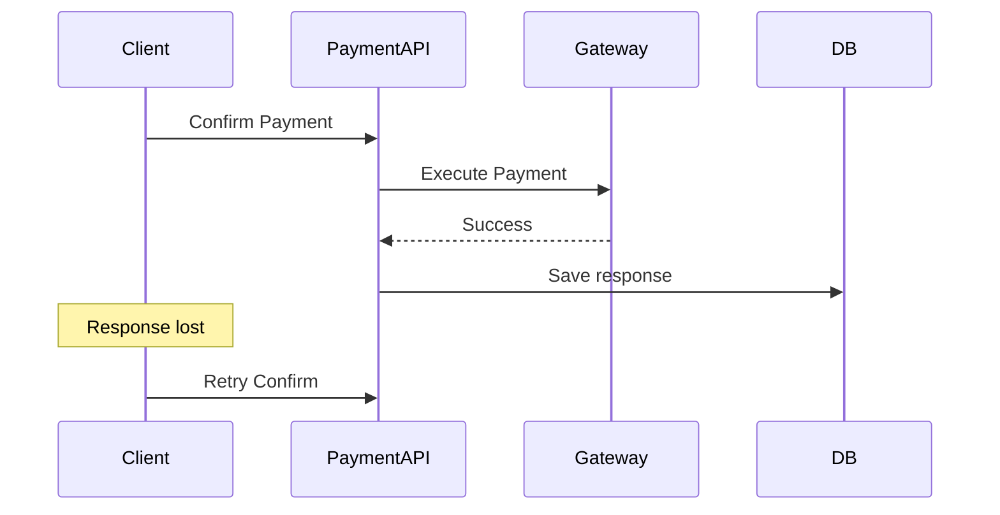
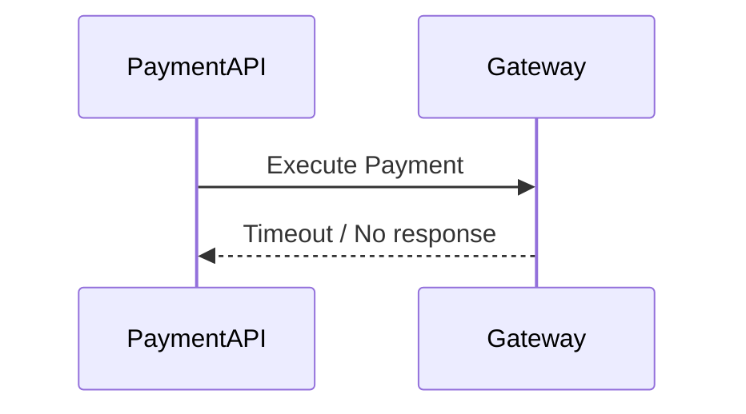
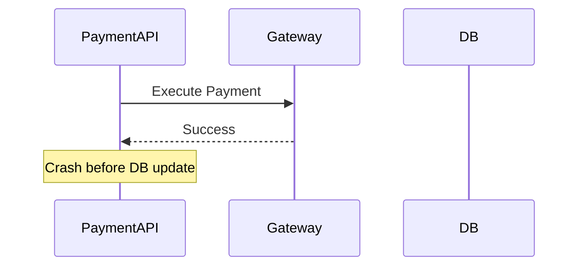

## 1. Why Failure Scenarios Matter

---

In distributed systems, the happy path is only part of the story.

Payment systems interact with:

- clients
- databases
- external gateways
- unreliable networks

This means failures are not rare — they are expected.

> 📝 **Key Insight:**  
> Strong payment system design is not about making success work once — it is about behaving safely when things go wrong.

---

## 2. Categories of Failure in Payment Systems

---

Most failure scenarios fall into one of these categories:

1. **Client-side failures**
2. **API / service failures**
3. **Database failures**
4. **Gateway failures**
5. **Network failures**

Each category can lead to different system behavior and different recovery strategies.

---

## 3. Scenario 1 — Client Retries Because Response Was Lost

---

### Flow



### Problem

- client assumes request failed
- same request is sent again

### Risk

- duplicate charge if retry is treated as new

### Solution

- use idempotency key
- return stored response on retry

---

## 4. Scenario 2 — Gateway Timeout

---

### Flow



### Problem

The API does not know whether:

- payment succeeded
- payment failed
- payment is still being processed

👉 This is an **unknown state**.

### Solution

- do not assume success or failure blindly
- mark payment as `PROCESSING` or `PENDING_REVIEW`
- retry carefully or reconcile later

---

## 5. Scenario 3 — Gateway Success, API Crashes Before DB Update

---

### Flow



### Problem

Externally:

- payment succeeded

Internally:

- system may still show `PROCESSING` or `FAILED`

👉 This causes **state inconsistency**.

### Solution

- store idempotency response as early as possible
- use reconciliation with gateway
- design recovery jobs for incomplete states

---

## 6. Scenario 4 — Duplicate Confirm Requests Arrive Concurrently

---

### Problem

Two confirm requests arrive almost simultaneously:

```text
Thread A → Confirm
Thread B → Confirm
```

### Risk

- both may execute gateway call

### Solution

- DB locking or optimistic locking
- validate state transition atomically
- use idempotency record with `IN_PROGRESS` state

---

## 7. Scenario 5 — Duplicate Create Requests with Different Keys

---

### Problem

Two create requests use:

- same `orderId`
- different idempotency keys

### Risk

- multiple payment records for same business intent

### Solution

- add business-level rule: only one active payment per order
- return existing payment or reject new one

---

## 8. Scenario 6 — Database Write Succeeds, Response Fails

---

### Problem

The system creates or updates the payment record, but the client never receives the response.

### Risk

- client retries unnecessarily

### Solution

- idempotency ensures same response can be replayed
- client sees consistent result after retry

---

## 9. Scenario 7 — Idempotency Key Reused with Different Payload

---

### Problem

The same idempotency key is sent with:

- different `orderId`
- different amount
- different payload

### Risk

- system cannot determine original intent safely

### Solution

- compare request hash
- reject mismatched reuse

---

## 10. Scenario 8 — Idempotency Record Expires Too Early

---

### Problem

A retry arrives after the idempotency key TTL has expired.

### Risk

- request may be treated as new
- duplicate effects may happen

### Solution

- choose TTL carefully
- align TTL with expected retry window

---

## 11. Scenario 9 — Payment Gateway Is Down

---

### Problem

Gateway is unavailable or returning repeated errors.

### Risk

- all confirm operations fail
- poor client experience

### Solution

- return appropriate 5xx or retryable response
- apply retry / backoff strategy
- consider circuit breaker in advanced design

---

## 12. Why Reconciliation Matters

---

Some failures create states where the system cannot safely decide the final outcome.

Examples:

- timeout after gateway call
- API crash after gateway success

In these cases, the system may need a **reconciliation process**:

- query gateway later
- verify actual payment outcome
- correct internal state

> 📝 **Key Insight:**  
> Idempotency prevents many duplicate effects, but reconciliation is still needed for ambiguous failures.

---

## 13. Summary Table

---

| Scenario                | Risk                     | Primary Protection                |
| ----------------------- | ------------------------ | --------------------------------- |
| Response lost           | duplicate retry          | idempotency replay                |
| Gateway timeout         | unknown state            | processing state + reconciliation |
| API crash after success | inconsistent state       | recovery + reconciliation         |
| Concurrent confirm      | duplicate charge         | concurrency control               |
| Duplicate create        | multiple payment records | business rule + idempotency       |
| Key reuse mismatch      | ambiguous intent         | request hash validation           |

---

## Conclusion

---

Failure scenarios are where payment system design is truly tested.

A robust design must be able to handle:

- retries
- timeouts
- crashes
- partial failures
- unknown outcomes

without causing duplicate charges or inconsistent state.

---

### 🔗 What’s Next?

👉 **[Retry Strategy & Behavior →](/learning/advanced-skills/system-design-practice/intermediate-systems/6_payment-api/5_phase-5/5_7_retry-strategy-and-behaviour/)**

---

> 📝 **Takeaway**:
>
> - Failures are expected in distributed payment systems
> - The biggest risks are duplicate effects and unknown states
> - Idempotency, state control, and reconciliation must work together
