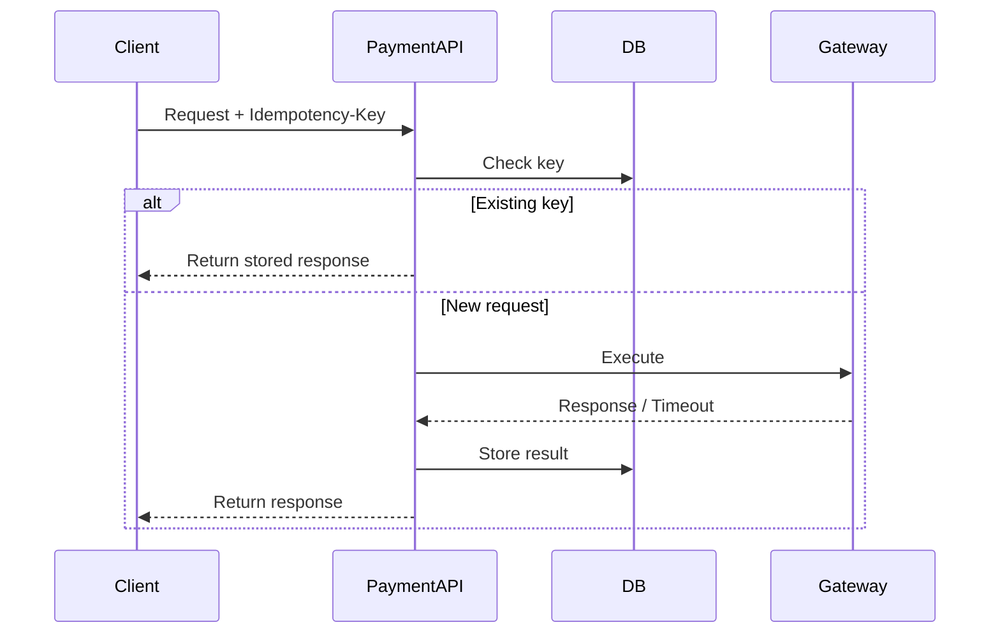

## 1. Why Retry Strategy Matters

---

Retries are inevitable in distributed systems.

But **blind retries are dangerous**, especially in payment systems.

> 📝 **Key Insight:**  
> A good retry strategy ensures reliability without causing duplicate side effects.

---

## 2. Who Should Retry?

---

Retries can be triggered by:

### 1. Client (Frontend / Calling Service)

- retries on timeout
- retries on network failure

---

### 2. Backend (Server-Side Retry)

- retries gateway calls
- retries transient failures

---

### Best Practice

👉 Prefer **client-driven retries** for API calls  
👉 Use **server retries carefully** for internal operations

---

## 3. When is it Safe to Retry?

---

### Safe to Retry

- request timed out
- network failure occurred
- received 5xx response

---

### Not Safe to Retry Blindly

- request may have already succeeded
- external system state is unknown

👉 This is why idempotency is critical.

---

## 4. Retry Decision Matrix

---

| Scenario         | Retry? | Reason            |
| ---------------- | ------ | ----------------- |
| 2xx Success      | ❌ No  | Already completed |
| 4xx Client Error | ❌ No  | Fix request first |
| 5xx Server Error | ✅ Yes | Temporary failure |
| Timeout          | ✅ Yes | Unknown result    |

---

## 5. Exponential Backoff Strategy

---

Instead of retrying immediately, use **exponential backoff**.

### Example

```text
Retry 1 → after 1 second
Retry 2 → after 2 seconds
Retry 3 → after 4 seconds
Retry 4 → after 8 seconds
```

---

### Why?

- reduces load on system
- avoids retry storms
- improves stability

---

## 6. Retry Flow with Idempotency

---



---

## 7. Handling Retry Limits

---

Retries should not be infinite.

### Strategy

- limit number of retries (e.g., 3–5 attempts)
- fail gracefully after limit

---

### Why?

- prevents system overload
- avoids infinite loops

---

## 8. Handling Long-Running / Unknown State

---

### Scenario

- gateway timeout
- unknown payment status

---

### Strategy

- mark payment as `PROCESSING`
- allow retries with idempotency
- use reconciliation if needed

---

## 9. Retry Anti-Patterns

---

### ❌ Immediate Retry Loop

- causes system overload

---

### ❌ Retrying Without Idempotency

- leads to duplicate charges

---

### ❌ Infinite Retries

- never resolves failure

---

### ❌ Retrying Client Errors

- wastes resources

---

## 10. Best Practices Summary

---

- always use idempotency for retryable operations
- retry only when failure is temporary
- use exponential backoff
- limit retry attempts
- design for safe retries, not just retries

---

## Conclusion

---

Retries are essential for building reliable systems, but they must be controlled and safe.

A well-designed retry strategy ensures:

- system stability
- consistent behavior
- protection against duplicate processing

---

### 🔗 What’s Next?

👉 **[Idempotency vs Exactly-Once Semantics →](/learning/advanced-skills/system-design-practice/intermediate-systems/6_payment-api/5_phase-5/5_8_idempotency-vs-exactly-once/)**

---

> 📝 **Takeaway**:
>
> - Retries are inevitable, but must be controlled
> - Use idempotency to make retries safe
> - Apply exponential backoff and retry limits for stability
