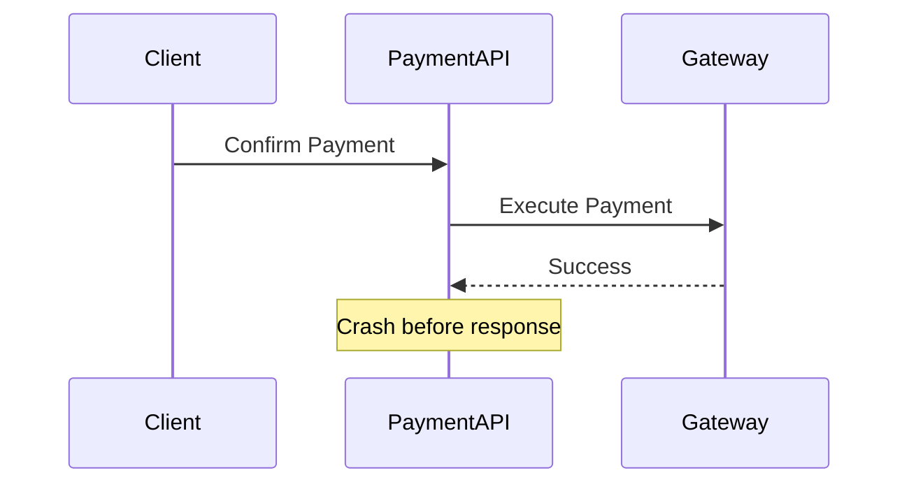
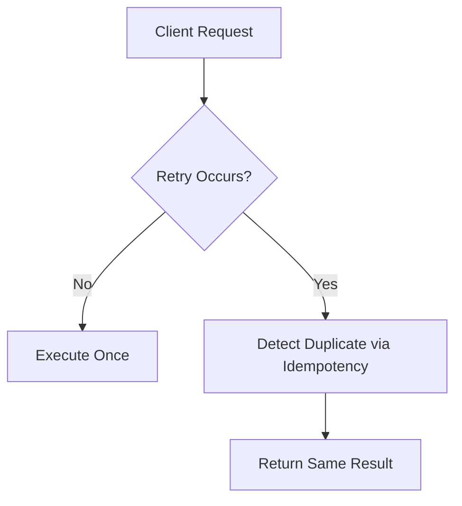

## 1. Why This Topic Matters

---

In payment systems, one of the most common expectations is:

> ❓ _"The payment should happen exactly once."_

This sounds simple, but in distributed systems, it is **extremely hard to guarantee**.

> 📝 **Key Insight:**  
> Exactly-once execution is not truly achievable in most distributed systems — it is **approximated using design techniques like idempotency**.

---

## 2. Understanding Delivery Semantics

---

Before comparing idempotency and exactly-once, we need to understand three key concepts.

### 1. At-Most-Once

- operation happens **zero or one time**
- no retries

#### Problem

- request may be lost
- payment may never happen

---

### 2. At-Least-Once

- operation happens **one or more times**
- retries are allowed

#### Problem

- duplicates may occur
- multiple charges possible

---

### 3. Exactly-Once (Ideal)

- operation happens **exactly once**

#### Problem

- extremely difficult to guarantee in distributed systems

---

## 3. Why Exactly-Once is Hard

---

Consider this scenario:



Now the system is in an **uncertain state**:

- Did the payment succeed? ✅ Possibly
- Did the client receive response? ❌ No

Client retries:

```text
Retry → Confirm Payment again
```

👉 Without safeguards, this may lead to **duplicate execution**.

---

## 4. So What Do Real Systems Do?

---

Instead of true exactly-once, systems implement:

> 👉 **At-least-once execution + idempotency = effectively-once behavior**

---

## 5. What is Idempotency (Revisited)

---

Idempotency ensures:

> Repeating the same request does not create additional side effects.

Example:

```text
Request 1 → Payment executed
Request 2 → Same response returned, no new execution
```

---

## 6. How Idempotency Approximates Exactly-Once

---



---

### Result

- duplicate requests do not cause duplicate side effects
- system behaves _as if_ it executed once

👉 This is called **effectively-once behavior**.

---

## 7. Key Differences

---

| Aspect         | Idempotency                 | Exactly-Once                 |
| -------------- | --------------------------- | ---------------------------- |
| Guarantee      | Same result on retries      | Operation happens once       |
| Feasibility    | Practical                   | Very hard / theoretical      |
| Implementation | Keys + storage + validation | Requires global coordination |
| Used in        | Real-world systems          | Rare / limited cases         |

---

## 8. Where Idempotency is Applied in Our Design

---

We used idempotency in:

- `POST /payments` → prevent duplicate records
- `POST /payments/{id}/confirm` → prevent duplicate execution

Combined with:

- state validation
- concurrency control
- retry strategy

👉 This gives us **effectively-once behavior**.

---

## 9. Limitations of Idempotency

---

Idempotency is powerful, but not perfect.

### Limitations

- depends on key reuse
- limited by TTL
- does not solve unknown states completely

---

### Example

- gateway success + API crash
- idempotency helps on retry
- but reconciliation may still be needed

---

## 10. Role of Reconciliation

---

When the system cannot determine outcome reliably:

👉 reconciliation becomes necessary

### Example

- query payment gateway later
- update system state accordingly

---

> 📝 **Key Insight:**  
> Idempotency prevents duplicates, but reconciliation resolves uncertainty.

---

## 11. Real-World Thinking

---

Instead of asking:

> “How do we guarantee exactly-once?”

Good engineers ask:

- how do we prevent duplicate side effects?
- how do we handle retries safely?
- how do we recover from unknown states?

---

## Conclusion

---

Exactly-once execution is an ideal goal, but not a practical guarantee in distributed systems.

Real-world systems achieve similar behavior by combining:

- idempotency
- retry control
- state validation
- reconciliation

This creates **effectively-once behavior**, which is sufficient for most payment systems.

---

### 🔗 What’s Next?

👉 **[Design Trade-offs & Limitations →](/learning/advanced-skills/system-design-practice/intermediate-systems/6_payment-api/5_phase-5/5_9_design-tradeoffs-and-limitations/)**

---

> 📝 **Takeaway**:
>
> - Exactly-once is extremely hard to guarantee
> - Idempotency enables effectively-once behavior
> - Real systems rely on multiple safeguards, not a single guarantee
