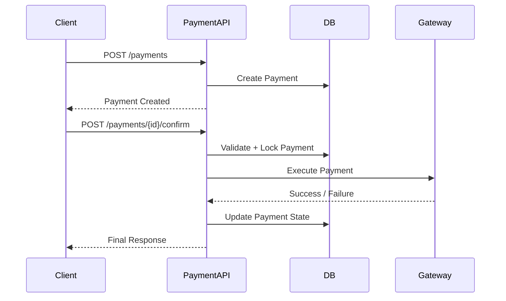
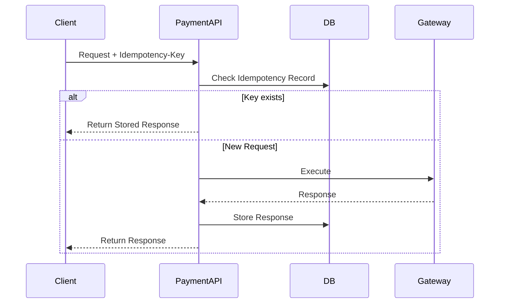

## 1. Why Processing Flow Matters

---

So far, we have designed:

- API contracts (Phase 4)
- Idempotency and retry safety (Phase 5)

Now we answer the most important practical question:

> ❓ _What actually happens inside the system when a payment request is made?_

> 📝 **Key Insight:**  
> A good system design is not just about components—it is about **how data and control flow through those components**.

---

## 2. High-Level Payment Flow

---

At a high level, a payment follows this lifecycle:

```text
Create Payment → Confirm Payment → Process via Gateway → Update State → Return Response
```

This flow connects:

- client interaction
- backend processing
- external gateway execution

---

## 3. Key Components Involved

---

The processing flow involves the following components:

- **Client** (Web / Mobile / Backend Service)
- **Payment API Service**
- **Database (DB)**
- **External Payment Gateway**

---

### Responsibilities

| Component   | Responsibility                                 |
| ----------- | ---------------------------------------------- |
| Client      | Initiates requests, handles retries            |
| Payment API | Core business logic, validation, orchestration |
| Database    | Stores payments, attempts, idempotency records |
| Gateway     | Executes actual payment                        |

---

## 4. End-to-End Processing Flow (High-Level)

---



---

## 5. Where Idempotency Fits In

---

From Phase 5, idempotency plays a critical role at two points:

### 1. Create Payment

- prevents duplicate payment records

### 2. Confirm Payment

- prevents duplicate gateway execution

---

### Updated Flow with Idempotency



---

## 6. Where State Transitions Happen

---

State transitions are central to processing flow.

### Example Lifecycle

```text
CREATED → PROCESSING → SUCCEEDED / FAILED
```

---

### Important Rules

- state transitions must be **controlled and validated**
- invalid transitions must be rejected
- transitions must be **atomic** (no partial updates)

---

## 7. Synchronous vs Asynchronous Processing

---

### Synchronous (Current Design)

- confirm request waits for gateway response
- client gets final result immediately

---

### Asynchronous (Future Extension)

- API returns `PROCESSING`
- result delivered later via polling/webhook

---

> 📝 For this design, we focus on **synchronous flow** for simplicity.

---

## 8. Key Observations from the Flow

---

### 1. Payment API is the Orchestrator

- coordinates all steps
- ensures correctness

---

### 2. Database is the Source of Truth

- stores payment state
- stores idempotency records

---

### 3. Gateway is External and Unreliable

- must handle failures carefully

---

### 4. Client May Retry Anytime

- system must remain safe under retries

---

## 9. What We Will Dive Into Next

---

This overview sets the foundation.

Next, we will break down the flow into detailed steps:

- Create Payment Flow (validation + persistence)
- Confirm Payment Flow (execution + state transitions)

---

## Conclusion

---

The processing flow connects all parts of the system into a working pipeline.

It shows:

- how requests move through the system
- where validations happen
- where state changes occur
- how external systems are integrated

---

### 🔗 What’s Next?

👉 **[Create Payment Flow (Step-by-Step) →](/learning/advanced-skills/system-design-practice/intermediate-systems/6_payment-api/6_phase-6/6_2_create-payment-flow/)**

---

> 📝 **Takeaway**:
>
> - Processing flow connects design to execution
> - Payment API orchestrates the entire lifecycle
> - Idempotency and state transitions are critical in flow design
