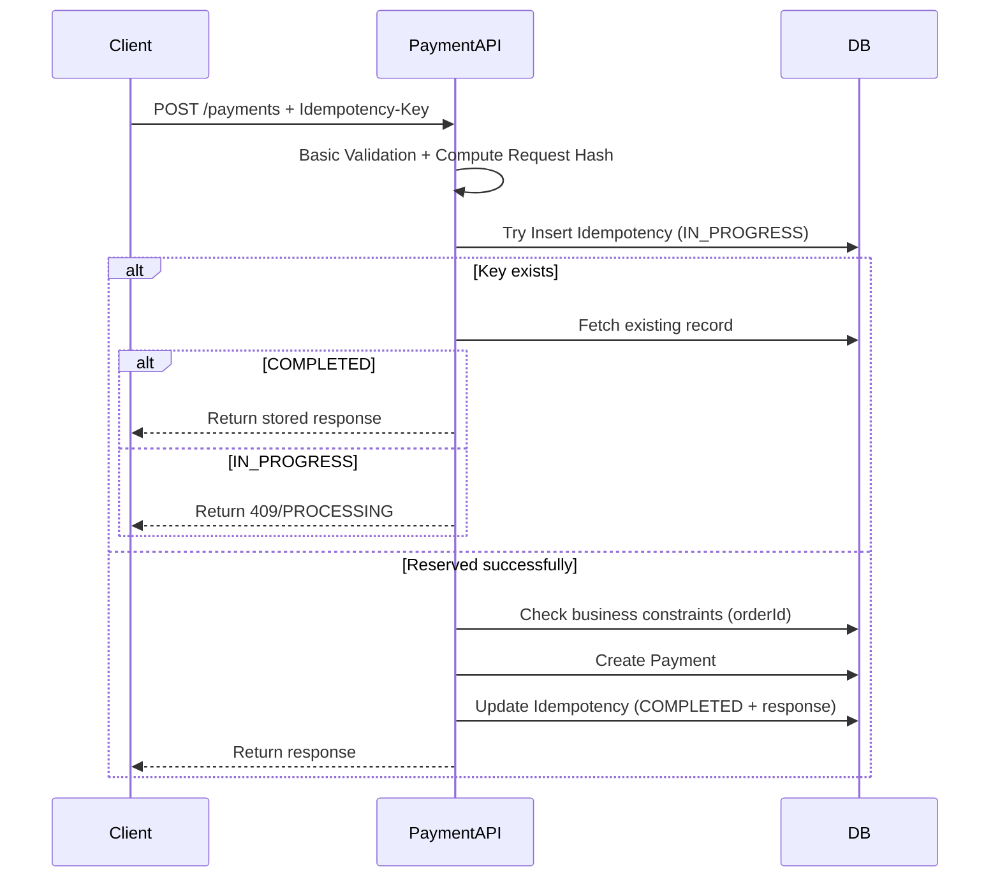

## 1. Purpose of Create Payment

---

The **Create Payment** API initializes a payment record in the system.

```java
POST /payments
```

It does **not** execute the payment.

> 📝 **Key Insight:**  
> Creation defines intent. Execution happens later during confirm.

---

## 2. What This Flow Must Ensure

---

The create flow must guarantee:

- no duplicate payment records (idempotency)
- valid input data
- correct initial state
- consistent response for retries

---

## 3. High-Level Flow

---



---

## 4. Step-by-Step Execution

---

### Step 1: Receive Request

Client sends:

```java
POST /payments
Idempotency-Key: <key>
```

Payload example:

```json
{
  "orderId": "ORD-123",
  "amount": 100.0,
  "currency": "GBP",
  "paymentMethod": "TOKEN_ABC"
}
```

---

### Step 2: Basic Validation

---

Validate obvious input issues first:

- `amount > 0`
- valid `currency`
- non-empty `orderId`
- valid `paymentMethod`

👉 Reject early to avoid polluting idempotency store with invalid requests.

---

### Step 3: Compute Request Hash

---

- compute a hash of the request payload

👉 Used later to detect incorrect idempotency key reuse.

---

### Step 4: Reserve Idempotency Key (Critical Step)

---

Try to **atomically insert** idempotency record:

```text
idempotencyKey = <key>
requestHash = <hash>
status = IN_PROGRESS
```

---

#### If insert fails (key already exists)

Fetch existing record:

- If `COMPLETED` → return stored response
- If `IN_PROGRESS` → return "processing" or `409 Conflict`
- If request hash mismatch → reject request

👉 This step **prevents race conditions** between concurrent requests.

---

### Step 5: Business Validation

---

Check for existing active payment for the same order.

#### If active payment exists

- return existing payment
- OR reject request based on policy

#### If no active payment

- proceed to creation

---

### Step 6: Create Payment Entity

---

Create new payment record:

```text
paymentId = generated UUID
status = CREATED
```

Persist in DB.

---

### Step 7: Build Response

---

Example response:

```json
{
  "paymentId": "pay_001",
  "status": "CREATED",
  "amount": 100.0,
  "currency": "GBP"
}
```

---

### Step 8: Complete Idempotency Record

---

Update idempotency record:

- `paymentId`
- `responsePayload`
- `status = COMPLETED`

---

### Step 9: Return Response

---

Return response to client.

---

## 5. Handling Edge Cases

---

### Case 1: Duplicate Request (Same Key)

- return same payment
- do not create new record
- if request is still `IN_PROGRESS`, return processing/409 instead of creating a new payment

---

### Case 2: Same Order, Different Key

- apply business rule
- allow or reject based on policy

---

### Case 3: Idempotency Key Reuse with Different Payload

- detect mismatch using request hash
- reject request

---

## 6. Key Design Decisions

---

### 1. Separation of Create and Confirm

- avoids accidental execution
- improves retry safety

---

### 2. Idempotency at Entry Point

- prevents duplicate DB writes and protects against race conditions via early reservation (`IN_PROGRESS`)

---

### 3. Business Constraint Layer

- prevents logical duplication (same order)

---

## 7. What This Flow Does NOT Do

---

The create flow does not:

- call payment gateway
- process money
- change state beyond `CREATED`

👉 Execution is handled in confirm flow.

---

## Conclusion

---

The create payment flow is primarily about:

- validation
- safe persistence
- idempotency handling

It sets up the system for the actual execution step.

---

### 🔗 What’s Next?

👉 **[Confirm Payment Flow (Step-by-Step) →](/learning/advanced-skills/system-design-practice/intermediate-systems/6_payment-api/6_phase-6/6_3_confirm-payment-flow/)**

---

> 📝 **Takeaway**:
>
> - Create flow defines payment intent
> - Idempotency prevents duplicate records
> - Business rules prevent logical duplication
> - No external execution happens at this stage
