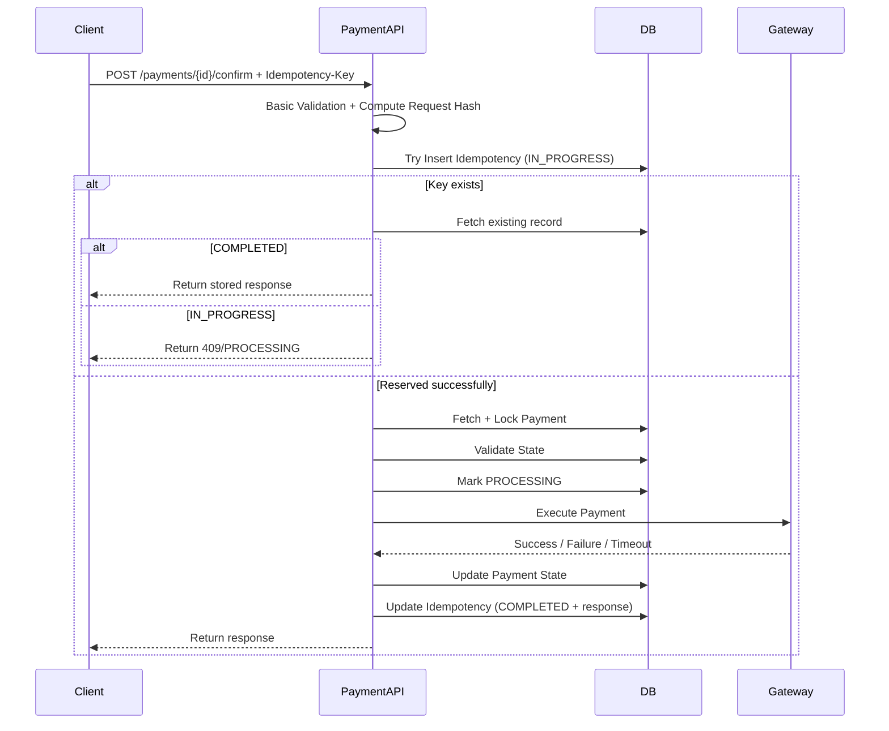

## 1. Why Confirm Flow is Critical

---

The **Confirm Payment** API is where actual money movement happens.

```java
POST /payments/{paymentId}/confirm
```

> 📝 **Key Insight:**  
> This is the most sensitive part of the system — mistakes here can lead to **duplicate charges or financial loss**.

---

## 2. What This Flow Must Guarantee

---

The confirm flow must ensure:

- payment is executed **at most once**
- duplicate requests do not trigger duplicate charges
- state transitions are valid and atomic
- concurrency is controlled
- failures are handled safely

---

## 3. High-Level Flow

---



---

## 4. Step-by-Step Execution

---

### Step 1: Receive Request

```java
POST /payments/{paymentId}/confirm
Idempotency-Key: <confirm-operation-key>
```

> 📝 Use a **different idempotency key** for confirm than the one used for create.
>
> - `POST /payments` → one idempotency key
> - `POST /payments/{paymentId}/confirm` → another idempotency key
>
> Idempotency keys should be scoped **per operation / endpoint**, not reused across different business actions.

---

### Step 2: Basic Validation

---

Validate obvious request issues first:

- `paymentId` is present and well-formed
- required headers exist
- idempotency key is present

👉 Reject malformed requests before touching idempotency or business state.

---

### Step 3: Compute Request Hash

---

- compute a hash of the confirm request payload / logical input

👉 Used to detect incorrect idempotency key reuse.

---

### Step 4: Reserve Idempotency Key (Critical Step)

---

Try to **atomically insert** idempotency record:

```text
idempotencyKey = <confirm-operation-key>
requestHash = <hash>
status = IN_PROGRESS
operation = CONFIRM_PAYMENT
```

#### If insert fails (key already exists)

Fetch existing record:

- If `COMPLETED` → return stored response
- If `IN_PROGRESS` → return `409 Conflict` or processing response
- If request hash mismatch → reject request

👉 This step prevents concurrent requests with the same key from triggering multiple gateway executions.

---

### Step 5: Fetch and Lock Payment

---

- fetch payment from DB
- apply **pessimistic lock** (`SELECT ... FOR UPDATE`)

👉 Ensures only one request can process the payment at a time.

---

### Step 6: State Validation

---

Allowed states:

- `CREATED`
- retryable `FAILED`

Reject if:

- `SUCCEEDED` → already processed
- `PROCESSING` → already in progress

---

### Step 7: Mark as PROCESSING

---

Update payment:

```text
status = PROCESSING
```

👉 Prevents other concurrent executions.

---

### Step 8: Call Payment Gateway

---

Send request to gateway:

- payment amount
- currency
- payment method token
- (optional but recommended) **gateway-level idempotency key**

👉 A strong design can forward a gateway-scoped idempotency key as an additional safety layer.

---

### Step 9: Handle Gateway Response

---

#### Case 1: Success

```text
status = SUCCEEDED
```

#### Case 2: Failure

```text
status = FAILED
failureReason = <reason>
```

#### Case 3: Timeout / Unknown

```text
status = PROCESSING
```

👉 Requires retry or reconciliation.

---

### Step 10: Persist Result

---

Update DB with:

- new status
- gateway reference
- failure reason (if any)

---

### Step 11: Complete Idempotency Record

---

Update idempotency record with:

- requestHash
- responsePayload
- status = COMPLETED

---

### Step 12: Return Response

---

Example:

```json
{
  "paymentId": "pay_001",
  "status": "SUCCEEDED",
  "gatewayReference": "txn_123"
}
```

---

## 5. Handling Edge Cases

---

### Case 1: Duplicate Confirm (Same Key)

- return stored response
- no new execution
- if request is still `IN_PROGRESS`, return processing/409 instead of executing again

---

### Case 2: Duplicate Confirm (Different Key)

- state validation and locking prevent re-execution, even if a different confirm key is used

---

### Case 3: Concurrent Requests

- locking ensures only one proceeds

---

### Case 4: Gateway Timeout

- keep status as `PROCESSING`
- retry or reconcile later

---

### Case 5: API Crash After Gateway Success

- idempotency ensures correct replay

---

## 6. Key Design Decisions

---

### 1. Idempotency at Confirm Level

- prevents duplicate gateway calls and protects against race conditions via early reservation (`IN_PROGRESS`)

---

### 2. State Validation Before Execution

- prevents invalid transitions

---

### 3. Locking for Concurrency Control

- prevents race conditions across concurrent confirm requests, including those with different idempotency keys

---

### 4. PROCESSING State

- handles long-running or unknown states

---

## 7. What Makes This Flow Complex

---

Compared to create flow, confirm flow must handle:

- external system interaction
- partial failures
- concurrency
- retries and idempotency

👉 This is why it is the core of payment system design.

---

## Conclusion

---

The confirm payment flow ensures that:

- payments are executed safely
- duplicate charges are prevented
- system remains consistent under failures

It combines multiple mechanisms:

- idempotency
- state validation
- locking
- failure handling

Also, confirm idempotency keys should be **different from create-payment keys** because they protect different operations in the payment lifecycle. In practice, idempotency is usually scoped per endpoint or per business action, not reused across unrelated operations.

---

### 🔗 What’s Next?

👉 **[End-to-End Sequence Diagrams →](/learning/advanced-skills/system-design-practice/intermediate-systems/6_payment-api/6_phase-6/6_4_end-to-end-sequence)**

---

> 📝 **Takeaway**:
>
> - Confirm flow is the most critical part of payment systems
> - Must prevent duplicate execution under all conditions
> - Requires combining multiple safeguards for correctness
