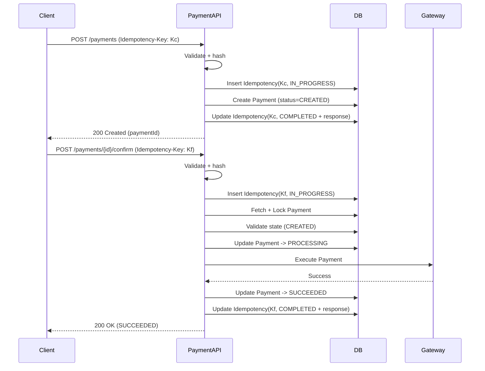
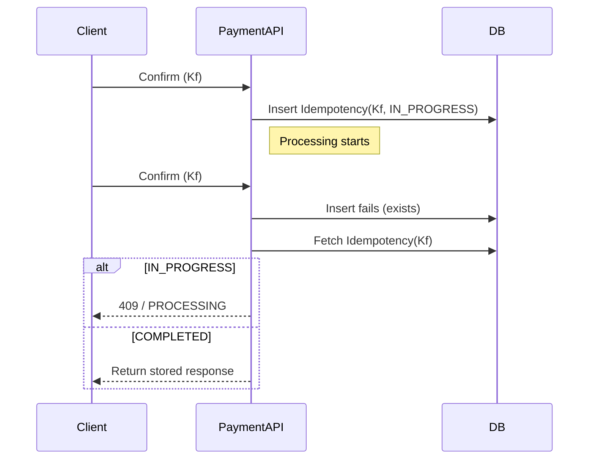
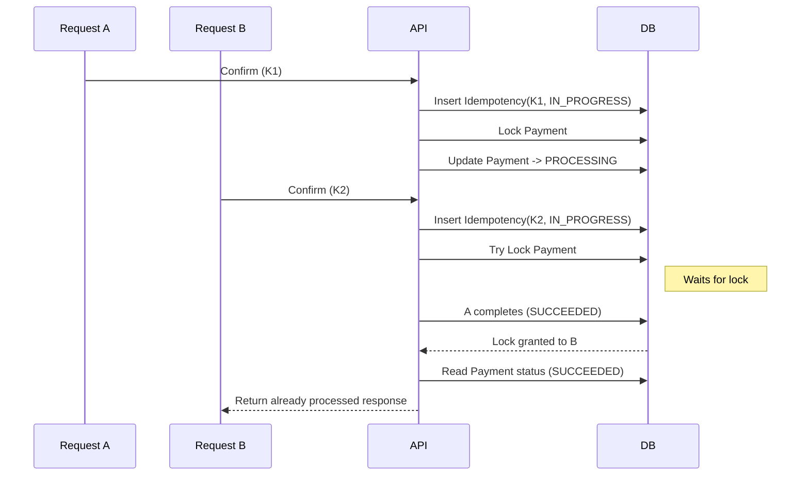
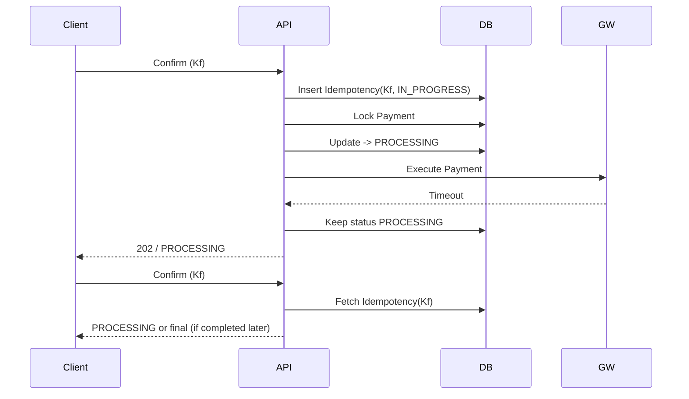

## 1. Why Sequence Diagrams Matter

---

So far, we have explained each part of the system separately:

- Create flow
- Confirm flow
- Idempotency
- Failure handling

Now we connect everything together.

> 📝 **Key Insight:**  
> Sequence diagrams help visualize **how components interact over time**, especially in the presence of retries and failures.

---

## 2. Components in the Flow

---

All diagrams use the same core components:

- **Client**
- **Payment API**
- **Database (DB)**
- **Payment Gateway**

---

## 3. Happy Path (Successful Payment)

---

---

## 4. Retry Flow (Same Idempotency Key)

---

Client retries the **same confirm request** using the same idempotency key.

👉 No duplicate execution happens.

---

## 5. Concurrent Confirm (Different Keys)

---

Two confirm requests arrive with **different idempotency keys**.

👉 Idempotency does not stop B here — **locking + state validation does**.

---

## 6. Gateway Timeout + Retry

---

👉 This shows how **unknown state** is handled safely.

---

## 7. Key Learnings from Diagrams

---

### 1. Idempotency is the First Gate

- stops duplicate requests early

---

### 2. Payment Locking is the Second Gate

- prevents concurrent execution

---

### 3. State Machine Controls Valid Flow

- ensures correct transitions

---

### 4. Gateway is Unreliable

- must handle timeouts and retries

---

### 5. Different Problems, Different Solutions

| Problem              | Solution               |
| -------------------- | ---------------------- |
| Same request retry   | Idempotency            |
| Concurrent execution | Locking                |
| Invalid flow         | State validation       |
| Unknown result       | Retry + reconciliation |

---

## Conclusion

---

End-to-end diagrams bring together all aspects of the system:

- API design
- idempotency
- concurrency control
- failure handling

They provide a clear picture of how a payment flows through the system under both normal and failure conditions.

---

### 🔗 What’s Next?

👉 **[Service Layer Design →](/learning/advanced-skills/system-design-practice/intermediate-systems/6_payment-api/6_phase-6/6_5_service-layer-design)**

---

> 📝 **Takeaway**:
>
> - Sequence diagrams clarify system behavior under real conditions
> - Idempotency and locking work together to ensure correctness
> - Always design for retries, failures, and concurrency
