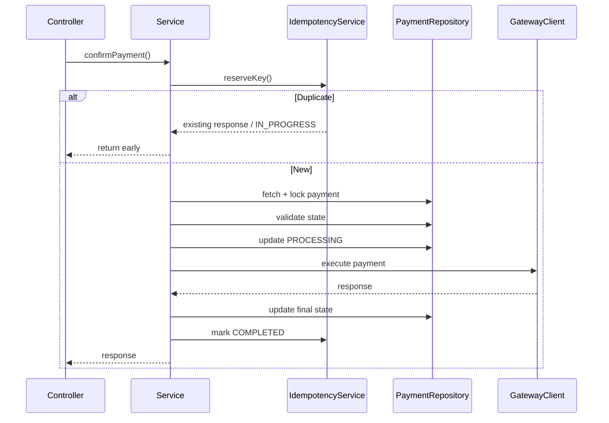

## 1. Why Service Layer Design Matters

---

So far, we have designed:

- APIs (Phase 4)
- Idempotency & retries (Phase 5)
- Execution flows (Phase 6)

Now we translate this into **real backend structure**.

> 📝 **Key Insight:**  
> Good system design is incomplete without a **clean separation of responsibilities** in code.

---

## 2. High-Level Layers

---

A typical backend for our payment API will have the following layers:

```text
Controller → Service → Repository → Database
                    ↓
               External Gateway
```

---

### Responsibilities

| Layer          | Responsibility                   |
| -------------- | -------------------------------- |
| Controller     | Handle HTTP requests/responses   |
| Service        | Business logic and orchestration |
| Repository     | Database interaction             |
| Gateway Client | External payment execution       |

---

## 3. Component Breakdown

---

### 1. PaymentController

Handles incoming API requests.

#### Responsibilities

- parse request
- validate basic input
- extract idempotency key
- call service layer
- return response

---

### 2. PaymentService

Core orchestrator of payment logic.

#### Responsibilities

- coordinate idempotency handling
- apply business validation
- manage state transitions
- call gateway
- handle failures

👉 This is where most logic lives.

---

### 3. IdempotencyService

Dedicated component for idempotency logic.

#### Responsibilities

- reserve idempotency key (`IN_PROGRESS`)
- validate request hash
- return stored response if exists
- mark request as `COMPLETED`

👉 Keeps idempotency logic separate from business logic.

---

### 4. PaymentRepository

Handles database operations.

#### Responsibilities

- fetch payment by ID
- create payment
- update payment status
- apply locking (`SELECT ... FOR UPDATE`)

---

### 5. IdempotencyRepository

Handles idempotency persistence.

#### Responsibilities

- insert idempotency record (atomic)
- fetch existing record
- update status and response

---

### 6. GatewayClient

Encapsulates external payment gateway interaction.

#### Responsibilities

- send payment request
- handle response parsing
- abstract provider-specific logic

---

## 4. Interaction Flow (Confirm Payment)

---



---

## 5. Example Method Structure

---

### Confirm Payment (Pseudo-code)

```java
public PaymentResponse confirmPayment(String paymentId, String idemKey, Request request) {

    // Step 1: Reserve idempotency key
    IdempotencyResult idem = idempotencyService.reserve(idemKey, request);

    if (idem.isCompleted()) {
        return idem.getStoredResponse();
    }

    if (idem.isInProgress()) {
        throw new ConflictException("Request already in progress");
    }

    // Step 2: Fetch and lock payment
    Payment payment = paymentRepository.findAndLock(paymentId);

    // Step 3: Validate state
    validateState(payment);

    // Step 4: Mark processing
    payment.markProcessing();
    paymentRepository.save(payment);

    // Step 5: Call gateway
    GatewayResponse response = gatewayClient.execute(payment);

    // Step 6: Update final state
    payment.applyResponse(response);
    paymentRepository.save(payment);

    // Step 7: Complete idempotency
    idempotencyService.complete(idemKey, response);

    return buildResponse(payment);
}
```

---

## 6. Key Design Principles

---

### 1. Separation of Concerns

- Controller → HTTP layer
- Service → business logic
- Repository → persistence
- Gateway → external integration

---

### 2. Idempotency as a First-Class Component

- not embedded in business logic
- reusable across endpoints

---

### 3. Service as Orchestrator

- controls flow
- enforces correctness

---

### 4. External Isolation

- gateway logic isolated
- easier to switch providers

---

## 7. Common Mistakes to Avoid

---

### ❌ Mixing idempotency inside business logic

- makes code complex

---

### ❌ Fat controllers

- logic should not live in controller

---

### ❌ Direct DB access from controller

- breaks layering

---

### ❌ Tight coupling with gateway

- hard to change provider later

---

## Conclusion

---

A clean service layer design ensures that:

- logic is modular
- code is maintainable
- system is extensible

It translates system design into **real, production-ready backend structure**.

---

### 🔗 What’s Next?

👉 **[Putting It All Together →](/learning/advanced-skills/system-design-practice/intermediate-systems/6_payment-api/6_phase-6/6_6_putting-it-all-together)**

---

> 📝 **Takeaway**:
>
> - Service layer is the backbone of backend systems
> - Clear separation improves maintainability and scalability
> - Idempotency and gateway integration should be cleanly abstracted
