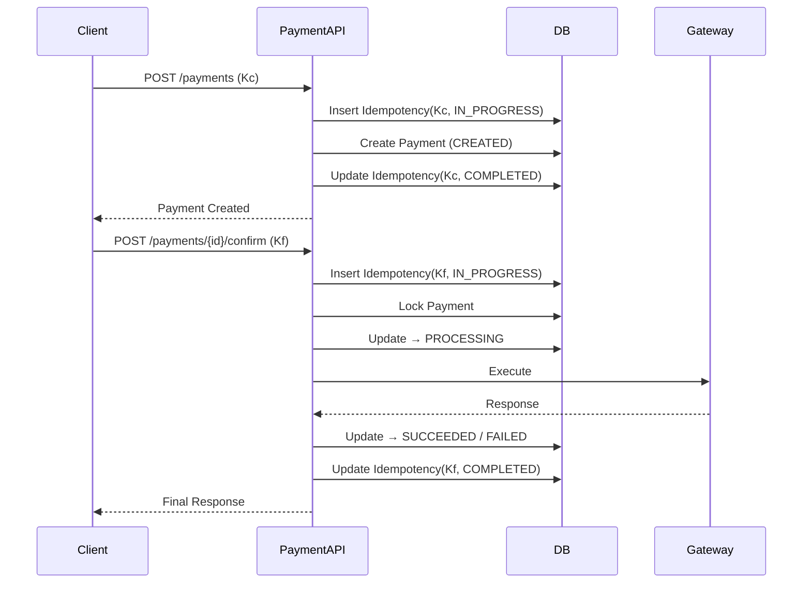

## 1. Why This Article Matters

---

We have designed the payment system in multiple phases:

- API design
- Idempotency & retry handling
- Processing flows
- Service layer structure

Now we bring everything together into a **single cohesive model**.

> 📝 **Key Insight:**  
> A strong system design is not just about individual components, but how they **work together under real conditions**.

---

## 2. End-to-End Flow Overview

---

At a high level, the system works as follows:

```text
Create Payment → Confirm Payment → Execute via Gateway → Update State → Return Response
```

---

## 3. Full Lifecycle Walkthrough

---

### Step 1: Create Payment

- client sends `POST /payments`
- system performs:
  - basic validation
  - idempotency reservation (`IN_PROGRESS`)
  - business validation (order constraint)
  - payment creation (`CREATED`)
  - idempotency completion (`COMPLETED`)

---

### Step 2: Confirm Payment

- client sends `POST /payments/{id}/confirm`
- system performs:
  - idempotency reservation
  - duplicate detection
  - payment lock
  - state validation
  - transition to `PROCESSING`

---

### Step 3: Execute Payment

- call external payment gateway
- handle response:
  - success → `SUCCEEDED`
  - failure → `FAILED`
  - timeout → `PROCESSING`

---

### Step 4: Finalization

- update payment state
- store idempotency response
- return response to client

---

## 4. Complete System Flow (Diagram)

---



---

## 5. How Different Mechanisms Work Together

---

### 1. Idempotency

- prevents duplicate requests
- ensures safe retries

---

### 2. Payment State Machine

- controls valid transitions
- ensures consistency

---

### 3. Concurrency Control

- prevents parallel execution
- ensures single processing path

---

### 4. Gateway Abstraction

- isolates external dependency
- simplifies integration

---

### 5. Retry Handling

- ensures reliability under failure
- works with idempotency

---

## 6. What Happens Under Failures

---

### Case 1: Client Retry

- idempotency returns stored response

---

### Case 2: Concurrent Requests

- locking + state validation prevent duplication

---

### Case 3: Gateway Timeout

- system stays in `PROCESSING`
- retry or reconciliation later

---

### Case 4: API Crash

- idempotency ensures safe replay

---

## 7. Design Characteristics

---

This system is:

- **Correct** → prevents duplicate charges
- **Reliable** → handles retries safely
- **Consistent** → maintains valid state transitions
- **Extensible** → supports future features

---

## 8. What We Have Achieved

---

We started with a simple problem:

> Design a Payment API

And evolved it into a system that:

- handles real-world failures
- prevents race conditions
- supports retries safely
- integrates with external systems

---

## Conclusion

---

This completes the **core design of a reliable payment API system**.

We combined:

- API design
- idempotency
- state management
- concurrency control
- execution flow

into a cohesive solution.

---

### 🔗 What’s Next?

👉 **[Phase 7: Persistence & Data Design →](/learning/advanced-skills/system-design-practice/intermediate-systems/6_payment-api/7_phase-7/7_1_persistence-overview/)**

---

> 📝 **Takeaway**:
>
> - A payment system is more than an API—it is a coordinated workflow
> - Multiple safeguards must work together for correctness
> - Real-world design is about handling failures, not just success
