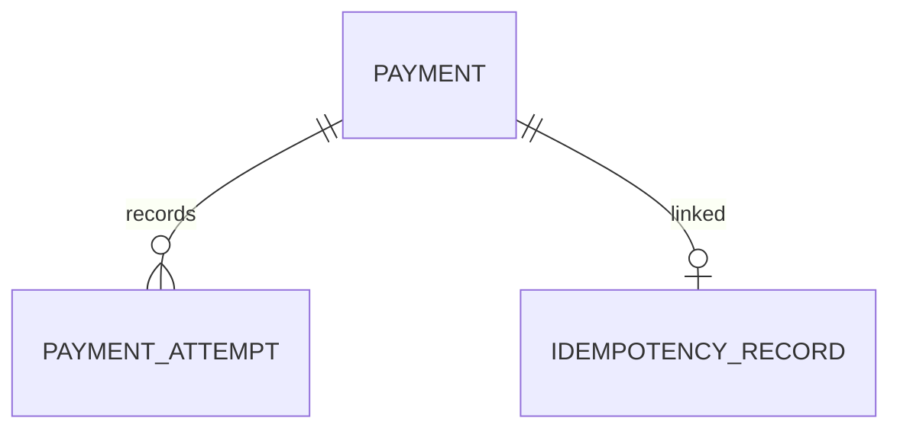

## 1. Why Persistence Matters

---

So far, we have designed:

- APIs and request/response models
- Idempotency and retry handling
- Processing flows and execution logic

All of these rely on one critical layer:

> ❗ **Persistent storage (database)**

> 📝 **Key Insight:**  
> Without reliable persistence, a payment system cannot guarantee correctness, recovery, or consistency.

---

## 2. What Do We Need to Persist?

---

A payment system must store multiple types of data:

### 1. Payments

- represents the main business entity
- stores current state of a payment

---

### 2. Payment Attempts

- tracks each interaction with the gateway
- helps with debugging and retries

---

### 3. Idempotency Records

- ensures duplicate requests are handled safely
- stores request and response mapping

---

### 4. (Optional Future) Audit / Logs

- record historical actions
- useful for compliance and debugging

---

## 3. Why Persistence is Critical in Payments

---

### 3.1 Recovery After Failures

Example:

- API crashes after gateway success
- system must recover state from DB

---

### 3.2 Safe Retries

- idempotency depends on stored records
- prevents duplicate processing

---

### 3.3 Consistent State Management

- payment lifecycle (`CREATED → PROCESSING → SUCCEEDED`)
- must be reliably stored and updated

---

### 3.4 Reconciliation

- compare system state with gateway state
- resolve inconsistencies

---

## 4. Source of Truth

---

In our design:

> 🟢 **Database is the source of truth**

---

### Why not cache?

- cache can lose data
- not reliable for correctness-critical systems

---

### Where cache can help

- idempotency lookup acceleration
- read-heavy endpoints

👉 But never as the only source of truth.

---

## 5. High-Level Data Model

---

---

### Interpretation

- one payment can have multiple attempts
- idempotency records link requests to payments

---

## 6. Design Goals for Persistence

---

Your database design should ensure:

### 1. Correctness

- no duplicate payments
- no inconsistent states

---

### 2. Atomicity

- operations should be all-or-nothing

---

### 3. Durability

- once written, data should not be lost

---

### 4. Traceability

- ability to debug and audit flows

---

### 5. Performance

- fast reads for:
  - payment lookup
  - idempotency check

---

## 7. How Persistence Supports Previous Phases

---

### Phase 4 — API Design

- request/response data stored in DB

---

### Phase 5 — Idempotency

- idempotency records stored and reused

---

### Phase 6 — Processing Flow

- payment state transitions persisted
- concurrency control via DB locks

---

## 8. What We Will Design Next

---

Now we move from high-level to detailed design.

Upcoming articles:

- Payments Table Design
- Payment Attempts Table
- Idempotency Table Design
- Relationships and constraints
- Indexing strategy

---

## Conclusion

---

Persistence is the backbone of a payment system.

It enables:

- correctness under failure
- safe retries
- consistent state management
- recovery and reconciliation

---

### 🔗 What’s Next?

👉 **[Payments Table Design →](/learning/advanced-skills/system-design-practice/intermediate-systems/6_payment-api/7_phase-7/7_2_payments-table-design)**

---

> 📝 **Takeaway**:
>
> - Database is the source of truth for payment systems
> - Persistence enables reliability and correctness
> - Proper data modeling is critical for system behavior
