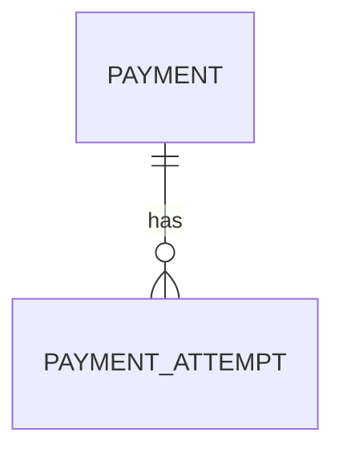

## 1. Why a Payment Attempts Table?

---

A payment is rarely a single-shot operation.

- network issues
- gateway failures
- retries

All of these lead to **multiple attempts** for the same payment.

> 📝 **Key Insight:**  
> The Payments table stores the _current state_, while the **Payment Attempts** table stores the _history of execution_.

---

## 2. What Problem Does It Solve?

---

Without this table, you cannot:

- debug failures
- understand retry behavior
- audit what actually happened
- reconcile with gateway systems

---

## 3. Core Schema (Recommended)

---

```text
PAYMENT_ATTEMPTS
- id (UUID, PK)
- payment_id (UUID, FK -> PAYMENTS.id)
- attempt_no (int)
- status (string)
- gateway_reference (string)
- failure_reason (string)
- raw_response (text/json)
- created_at (timestamp)
```

---

## 4. Field-by-Field Explanation

---

### 1. `id` (Primary Key)

- unique identifier for each attempt

---

### 2. `payment_id` (Foreign Key)

- links attempt to the parent payment

👉 One payment → many attempts

---

### 3. `attempt_no`

- sequence number of attempt (1, 2, 3…)

👉 Useful for ordering and debugging

---

### 4. `status`

Represents result of this attempt.

Typical values:

```text
INITIATED
SUCCESS
FAILED
TIMEOUT
```

---

### 5. `gateway_reference`

- transaction/reference ID returned by gateway

👉 Critical for reconciliation

---

### 6. `failure_reason`

- error message or code

👉 Helps debugging and retry decisions

---

### 7. `raw_response`

- full gateway response (optional)

👉 Useful for:

- debugging
- audit

⚠️ Avoid storing sensitive data

---

### 8. `created_at`

- timestamp of attempt

---

## 5. Relationship with Payments Table

---



---

### Interpretation

- One payment can have multiple attempts
- Each attempt represents one gateway interaction

---

## 6. When Do We Create an Attempt?

---

During confirm flow:

### Before calling gateway

```text
Create attempt with status = INITIATED
```

---

### After gateway response

Update attempt:

```text
SUCCESS / FAILED / TIMEOUT
```

---

## 7. Example Flow

---

### Scenario: Retry After Failure

```text
Attempt 1 → FAILED
Attempt 2 → TIMEOUT
Attempt 3 → SUCCESS
```

---

### Final Payment State

```text
Payment.status = SUCCEEDED
```

---

### Attempts Table Records

```text
Attempt 1 → FAILED
Attempt 2 → TIMEOUT
Attempt 3 → SUCCESS
```

👉 Full history preserved

---

## 8. Why Not Store Attempts in Payments Table?

---

### ❌ Bad Design

- multiple attempt fields in payments table
- overwriting previous attempts

---

### ✅ Good Design

- separate table
- normalized structure
- scalable and clean

---

## 9. Indexing Strategy

---

### Required

```text
INDEX(payment_id)
```

---

### Optional

```text
INDEX(gateway_reference)
```

---

### Why?

- `payment_id` → fetch all attempts quickly
- `gateway_reference` → reconciliation with gateway

---

## 10. How This Supports System Design

---

### Phase 5 — Idempotency

- ensures duplicate execution is avoided

---

### Phase 6 — Processing Flow

- tracks each gateway interaction

---

### Debugging & Observability

- identify failures
- analyze retry patterns

---

### Reconciliation

- match system state with gateway state

---

## 11. Example Record

---

```json
{
  "id": "att_001",
  "payment_id": "pay_001",
  "attempt_no": 2,
  "status": "FAILED",
  "gateway_reference": "txn_456",
  "failure_reason": "Insufficient funds",
  "created_at": "2026-01-01T10:00:05Z"
}
```

---

## Conclusion

---

The Payment Attempts table provides:

- execution history
- debugging capability
- audit trail
- retry visibility

It complements the Payments table by capturing **how we reached the current state**.

---

### 🔗 What’s Next?

👉 **[Idempotency Table Design →](/learning/advanced-skills/system-design-practice/intermediate-systems/6_payment-api/7_phase-7/7_4_idempotency-table-design)**

---

> 📝 **Takeaway**:
>
> - Payments table = current state
> - Payment attempts table = execution history
> - Both are required for a complete system design
