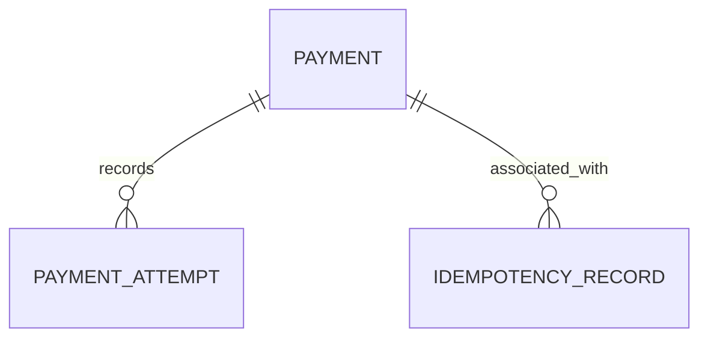
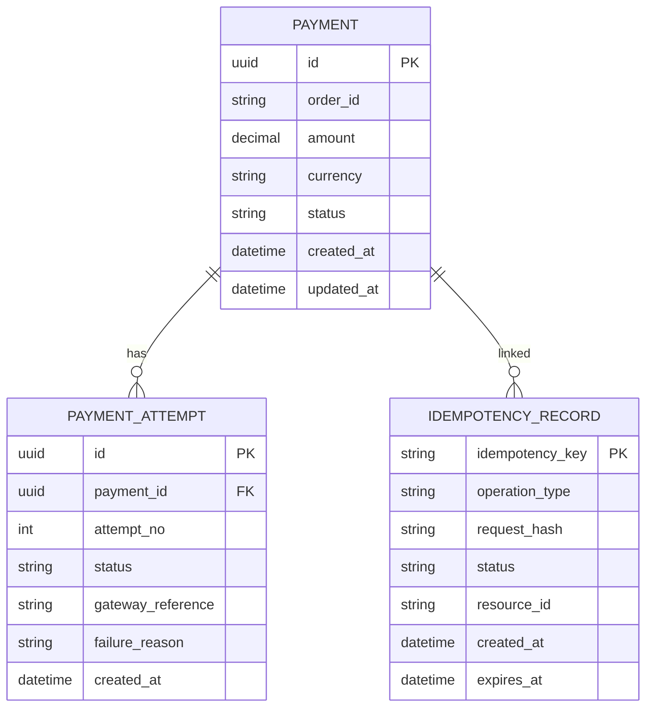

## 1. Why Relationships Matter

---

We have designed individual tables:

- Payments
- Payment Attempts
- Idempotency Records

Now we connect them into a **cohesive data model**.

> 📝 **Key Insight:**  
> Relationships define how data flows, how constraints are enforced, and how we reason about system behavior.

---

## 2. High-Level Relationships

---



---

### Interpretation

- One **Payment** → Many **Payment Attempts**
- One **Payment** → Many **Idempotency Records**

---

## 3. Payment → Payment Attempts (1:N)

---

### Relationship

```text
PAYMENT (1) ────> (N) PAYMENT_ATTEMPT
```

---

### Why?

A payment can have multiple attempts due to:

- retries
- failures
- timeouts

---

### Example

```text
Payment: pay_001

Attempts:
- att_1 → FAILED
- att_2 → TIMEOUT
- att_3 → SUCCESS
```

---

### Benefits

- full execution history
- debugging capability
- audit trail

---

## 4. Payment → Idempotency Records (1:N)

---

### Relationship

```text
PAYMENT (1) ────> (N) IDEMPOTENCY_RECORD
```

---

### Why not 1:1?

Because idempotency is **request-based**, not entity-based.

Different operations create different idempotency records:

- create payment request
- confirm payment request
- retry requests

---

### Example

```text
Payment: pay_001

Idempotency Records:
- (CREATE_PAYMENT, key_1)
- (CONFIRM_PAYMENT, key_2)
- (CONFIRM_PAYMENT retry, key_2)
```

---

### Important Note

Multiple idempotency records may point to the same payment.

👉 This is expected and correct.

---

## 5. Should Attempts Link to Idempotency?

---

### Optional Relationship

```text
PAYMENT_ATTEMPT → IDEMPOTENCY_RECORD (optional)
```

---

### When to use

- debugging specific request execution
- tracing request → attempt mapping

---

### When not needed

- basic system design
- minimal schema setups

---

👉 For your current design, this can remain optional.

---

## 6. Full ER Diagram (Detailed)

---



---

## 7. Design Decisions Explained

---

### 1. Separation of Concerns

- Payments → current state
- Attempts → execution history
- Idempotency → request safety

---

### 2. Loose Coupling

- idempotency not tightly bound to payment
- supports multiple operations

---

### 3. Traceability

You can answer:

- what is current payment status? → Payments table
- how did we reach here? → Attempts table
- was this request already processed? → Idempotency table

---

## 8. Query Patterns Supported

---

### 1. Fetch Payment Status

```sql
SELECT * FROM payments WHERE id = ?;
```

---

### 2. Fetch Payment Attempts

```sql
SELECT * FROM payment_attempts WHERE payment_id = ?;
```

---

### 3. Check Idempotency

```sql
SELECT * FROM idempotency_records
WHERE operation_type = ? AND idempotency_key = ?;
```

---

### 4. Reconciliation

```sql
SELECT * FROM payment_attempts
WHERE gateway_reference = ?;
```

---

## 9. Common Mistakes to Avoid

---

### ❌ Forcing 1:1 between payment and idempotency

- breaks retry handling

---

### ❌ Storing attempts inside payments table

- loses history
- bad scalability

---

### ❌ Ignoring relationships

- leads to inconsistent data model

---

## Conclusion

---

The relationships between tables ensure that:

- system remains consistent
- data is structured and traceable
- business logic is correctly supported

---

### 🔗 What’s Next?

👉 **[Indexing Strategy →](/learning/advanced-skills/system-design-practice/intermediate-systems/6_payment-api/7_phase-7/7_6_indexing-strategy)**

---

> 📝 **Takeaway**:
>
> - Payments = current state
> - Attempts = history
> - Idempotency = request safety
> - Relationships connect everything into a working system
