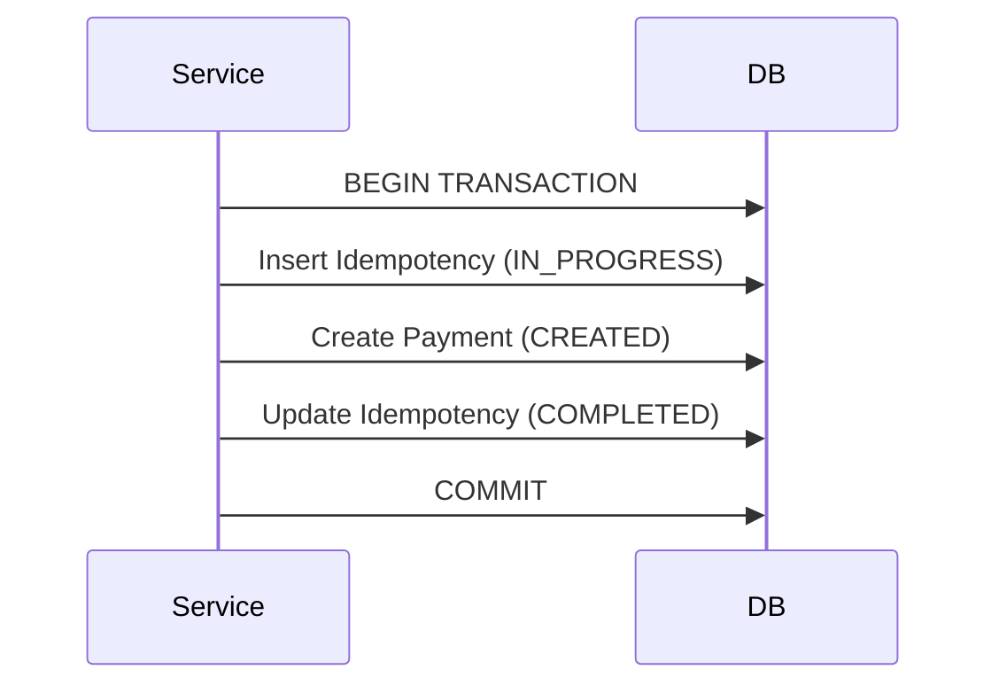

## 1. Why Transactions Matter

---

In a payment system, correctness is non-negotiable.

Consider failures:

- payment created but idempotency not updated
- gateway called but DB not updated
- partial updates due to crash

> 📝 **Key Insight:**  
> Transactions ensure that operations are **all-or-nothing**, preventing inconsistent system states.

---

## 2. What is a Transaction?

---

A transaction is a group of operations that execute as a single unit.

### ACID Properties (Practical View)

- **Atomicity** → all operations succeed or none
- **Consistency** → system remains valid
- **Isolation** → concurrent operations don’t interfere
- **Durability** → committed data is not lost

👉 In payment systems, **Atomicity and Consistency are most critical**.

---

## 3. Where Do We Need Transactions?

---

### 1. Create Payment Flow

We must ensure:

```text
Idempotency record + Payment creation → atomic
```

---

### 2. Confirm Payment Flow

We must ensure:

```text
Lock payment + Update status + Create attempt → atomic
```

---

### 3. Finalization Step

```text
Update payment + Update idempotency → atomic
```

---

## 4. Create Payment Transaction Flow

---



---

### Why?

If any step fails:

- no partial payment is created
- idempotency stays consistent

---

## 5. Confirm Payment Transaction Boundaries

---

⚠️ Important: We **cannot include external gateway calls inside a DB transaction**.

---

### Correct Approach

Split into phases:

### Phase 1: Pre-processing (Transaction)

```text
- Reserve idempotency
- Lock payment
- Validate state
- Mark PROCESSING
- Create attempt
```

---

### Phase 2: External Call (No Transaction)

```text
- Call payment gateway
```

---

### Phase 3: Finalization (Transaction)

```text
- Update payment status
- Update attempt
- Complete idempotency
```

---

## 6. Why Not Keep Transaction Open?

---

If you keep DB transaction open during gateway call:

- locks held for long time
- reduces throughput
- increases deadlock risk

👉 Always keep transactions **short and bounded**.

---

## 7. Handling Partial Failures

---

### Scenario 1: Gateway Success, DB Failure

- payment may be successful externally
- system state not updated

👉 Solution:

- retry using idempotency
- reconciliation process later

---

### Scenario 2: API Crash After Gateway Call

- idempotency record helps detect retry

---

### Scenario 3: Transaction Failure

- rollback ensures no partial state

---

## 8. Isolation & Concurrency

---

### Pessimistic Locking

```sql
SELECT * FROM payments WHERE id = ? FOR UPDATE;
```

- blocks concurrent updates

---

### Why Needed?

Without locking:

- two confirms may execute simultaneously
- leads to duplicate processing

---

## 9. Eventual Consistency (Real World)

---

Even with transactions, some parts are **eventually consistent**:

- gateway response vs DB state
- async retries

👉 Payment systems often combine:

- strong consistency (DB)
- eventual consistency (external systems)

---

## 10. Best Practices

---

### 1. Keep Transactions Short

- only DB operations

---

### 2. Never Include External Calls in Transactions

- avoids long locks

---

### 3. Use Idempotency + Transactions Together

- idempotency → duplicate protection
- transactions → atomicity

---

### 4. Design for Failure

- assume partial failures will happen

---

## 11. Common Mistakes to Avoid

---

### ❌ Long-running transactions

- leads to performance issues

---

### ❌ Ignoring transaction boundaries

- causes inconsistent state

---

### ❌ Mixing external calls inside transactions

- high risk of system slowdown

---

### ❌ Relying only on transactions

- idempotency is also required

---

## Conclusion

---

Transactions ensure:

- atomic updates
- consistent state
- safe recovery under failure

They are essential for maintaining correctness in a payment system.

---

### 🔗 What’s Next?

👉 **[Handling Partial Failures →](/learning/advanced-skills/system-design-practice/intermediate-systems/6_payment-api/7_phase-7/7_8_handling-partial-failures)**

---

> 📝 **Takeaway**:
>
> - Transactions provide atomicity and consistency
> - Keep transactions short and focused
> - Combine with idempotency for full safety
> - Always design for failure scenarios
