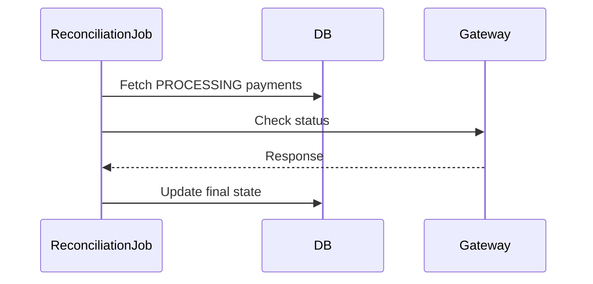

## 1. Why Partial Failures Matter

---

In real systems, failures are not clean.

You don’t just get:

- success ❌
- failure ❌

You often get **partial success**, where some parts of the system succeed while others fail.

> 📝 **Key Insight:**  
> A payment system must be designed to **recover from inconsistent intermediate states**, not just handle clean failures.

---

## 2. What is a Partial Failure?

---

A partial failure occurs when:

- one system succeeds
- another system fails

---

### Example

```text
Gateway: SUCCESS
Database: FAILED
```

👉 This is the most dangerous scenario.

---

## 3. Common Partial Failure Scenarios

---

### 1. Gateway Success, DB Update Fails

---

```text
Payment executed successfully
BUT
System failed to update DB
```

---

### 2. Gateway Timeout (Unknown State)

---

```text
Request sent
No response received
```

---

### 3. API Crash After Gateway Call

---

```text
Gateway executed
API crashed before response saved
```

---

### 4. Duplicate Retry During Processing

---

```text
Client retries while original request still running
```

---

## 4. Key Strategies to Handle Partial Failures

---

### 1. Idempotency (First Line of Defense)

- ensures retries do not duplicate execution
- returns consistent response

---

### 2. Persist Intermediate States

- use `PROCESSING` state
- store attempts before gateway call

---

### 3. Retry Mechanism

- retry failed operations safely
- rely on idempotency

---

### 4. Reconciliation (Critical)

- compare system state with gateway state
- fix inconsistencies

---

## 5. Handling Gateway Success + DB Failure

---

### Problem

```text
Payment completed externally
System does not know it
```

---

### Solution

1. Store payment in `PROCESSING`
2. Retry DB update using:
   - idempotency
   - retry job
3. Use reconciliation if needed

---

## 6. Handling Gateway Timeout

---

### Problem

```text
Did payment succeed or fail?
Unknown
```

---

### Solution

1. Keep payment in `PROCESSING`
2. Retry with same idempotency key
3. Query gateway using:
   - `gateway_reference` (if available)
4. Update final state

---

## 7. Reconciliation Strategy

---

Reconciliation is a background process.

### Steps

1. Fetch payments stuck in `PROCESSING`
2. Query gateway for status
3. Compare with DB state
4. Update system accordingly

---

### Example Flow



---

## 8. Retry Strategy

---

### Safe Retry

- use same idempotency key

---

### Retry Conditions

- timeout
- transient errors

---

### Backoff Strategy

```text
Retry after: 1s → 2s → 5s → 10s
```

---

## 9. Designing for Unknown State

---

The most important rule:

> ❗ Never assume failure when state is unknown

Instead:

- treat as `PROCESSING`
- verify before retrying execution

---

## 10. System Behavior Summary

---

| Scenario                  | Handling                |
| ------------------------- | ----------------------- |
| Gateway success + DB fail | Retry + reconciliation  |
| Gateway timeout           | Keep PROCESSING + retry |
| API crash                 | Idempotency replay      |
| Duplicate request         | Idempotency protection  |

---

## 11. Common Mistakes to Avoid

---

### ❌ Treating timeout as failure

- may cause double charge

---

### ❌ No reconciliation process

- leaves system inconsistent

---

### ❌ Not storing PROCESSING state

- no way to track in-flight operations

---

### ❌ Retrying without idempotency

- leads to duplicate execution

---

## Conclusion

---

Partial failures are unavoidable in distributed systems.

A robust payment system must:

- detect them
- recover from them
- prevent inconsistencies

---

### 🔗 What’s Next?

👉 **[Data Retention & Cleanup →](/learning/advanced-skills/system-design-practice/intermediate-systems/6_payment-api/7_phase-7/7_9_data-retention-and-cleanup)**

---

> 📝 **Takeaway**:
>
> - Partial failures are the hardest problems in system design
> - Idempotency + retries + reconciliation are key tools
> - Always design for unknown states, not just success/failure
