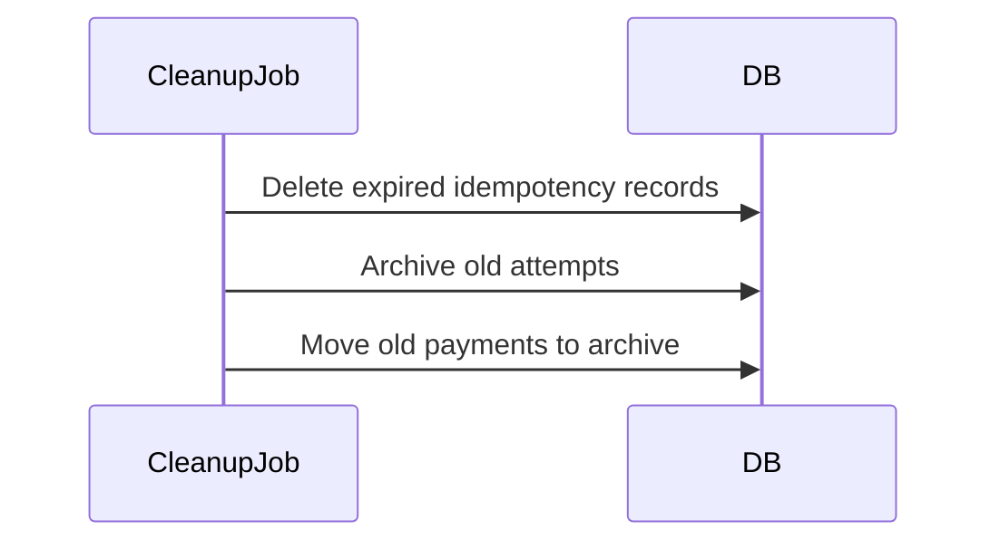

## 1. Why Data Retention Matters

---

As the system runs, data grows continuously:

- payments accumulate
- attempts increase
- idempotency records grow rapidly

> 📝 **Key Insight:**  
> Without proper retention and cleanup, the system will face **performance degradation, increased cost, and operational complexity**.

---

## 2. Types of Data and Retention Needs

---

### 1. Payments

- critical business data
- often retained long-term

---

### 2. Payment Attempts

- useful for debugging and audit
- medium-term retention

---

### 3. Idempotency Records

- only needed for short duration
- high write volume

---

## 3. Retention Strategy by Table

---

### Payments Table

---

Retention:

```text
Long-term (months to years)
```

Why?

- financial records
- audit requirements
- dispute resolution

---

### Payment Attempts Table

---

Retention:

```text
Medium-term (weeks to months)
```

Why?

- debugging
- reconciliation

---

### Idempotency Table

---

Retention:

```text
Short-term (24–48 hours)
```

Why?

- only needed for retry window

---

## 4. Cleanup Strategy

---

### 1. Idempotency Cleanup (High Priority)

---

Use TTL-based cleanup:

```sql
DELETE FROM idempotency_records
WHERE expires_at < NOW();
```

---

### Execution Options

- scheduled cron job
- background worker

---

### 2. Payment Attempts Cleanup

---

Options:

- archive old records
- delete after retention period

---

### 3. Payments Archival

---

Instead of deleting:

- move old data to archive tables
- or cold storage

---

## 5. Archival Strategy

---

### Why Archive Instead of Delete?

- compliance requirements
- audit trails

---

### Example

```text
payments_active → payments_archive
```

---

### Approaches

- periodic batch jobs
- partition-based movement

---

## 6. Partitioning for Scale

---

Large tables benefit from partitioning.

### Example

```text
Partition by created_at (monthly)
```

---

### Benefits

- faster queries
- easier cleanup
- efficient archival

---

## 7. Performance Considerations

---

### Without Cleanup

- table size grows
- indexes slow down
- queries degrade

---

### With Cleanup

- faster queries
- reduced storage cost
- stable performance

---

## 8. Compliance Considerations

---

Payment systems may require:

- data retention for audits
- GDPR compliance (data deletion rules)

---

### Important Rules

- avoid storing sensitive data unnecessarily
- mask or tokenize critical fields

---

## 9. Automation Strategy

---

### Recommended Setup

- cron-based cleanup job
- monitoring alerts
- logging of cleanup operations

---

### Example Flow



---

## 10. Common Mistakes to Avoid

---

### ❌ No cleanup strategy

- leads to massive tables

---

### ❌ Deleting critical payment data

- violates compliance

---

### ❌ Retaining idempotency data forever

- unnecessary storage overhead

---

### ❌ Ignoring monitoring

- cleanup failures go unnoticed

---

## Conclusion

---

Data retention and cleanup ensure that the system remains:

- performant
- cost-efficient
- compliant

---

### 🔗 What’s Next?

👉 **[Phase 8: Real-World Extensions →](/learning/advanced-skills/system-design-practice/intermediate-systems/6_payment-api/8_phase-8/8_1_overview)**

---

> 📝 **Takeaway**:
>
> - Not all data should be retained forever
> - Idempotency requires short-lived storage
> - Payments require long-term storage
> - Cleanup is essential for scalability
