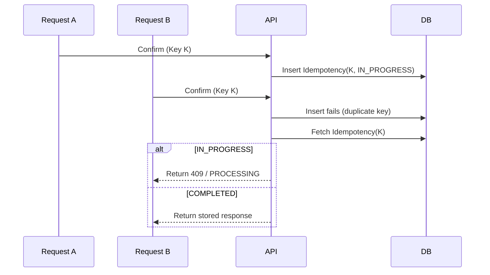
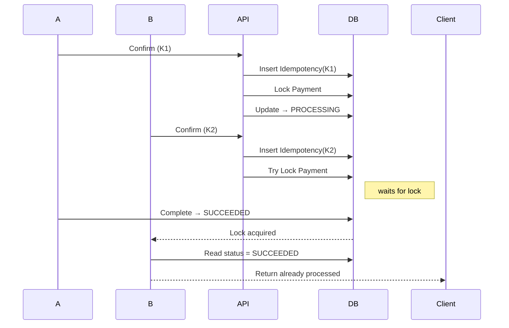

## 1. Why This Problem Matters

---

In real systems, multiple confirm requests can arrive for the same payment:

- user double clicks
- client retries due to timeout
- network duplication

> ❗ If not handled properly, this can lead to **double charging**.

---

## 2. What We Are NOT Repeating

---

We already covered:

- confirm flow
- idempotency basics
- payment states

👉 This article focuses only on **what happens when requests collide**.

---

## 3. Scenario Setup

---

Assume:

```text
payment.status = CREATED
```

Two requests arrive:

```text
Request A
Request B
```

---

## 4. Case 1 — Same Idempotency Key

---

### Flow



---

### Key Behavior

- only **one request (A)** proceeds
- B is stopped at idempotency layer
- no need to read or lock payment for B

---

> 📝 **Insight:**  
> Idempotency alone is sufficient for **same-key duplicates**.

---

## 5. Case 2 — Different Idempotency Keys

---

Now both requests use different keys:

```text
A → Key K1
B → Key K2
```

---

### Flow



---

### Key Behavior

- idempotency does NOT stop B
- locking ensures only one execution
- state validation prevents duplicate processing

---

> 📝 **Insight:**  
> For different keys, **locking + state validation** become critical.

---

## 6. Layered Protection Model

---

Concurrency is handled using multiple layers:

### Layer 1: Idempotency

- blocks same-key duplicates

---

### Layer 2: Locking

- ensures only one thread processes payment

---

### Layer 3: State Validation

- prevents invalid transitions

---

### Layer 4: Gateway Safety (Optional)

- gateway-level idempotency

---

## 7. Decision Matrix

---

| Scenario                 | Protection                   |
| ------------------------ | ---------------------------- |
| Same key retry           | Idempotency                  |
| Different key concurrent | Locking + State validation   |
| Unknown state retry      | Idempotency + Reconciliation |

---

## 8. Common Mistakes

---

### ❌ Only relying on idempotency

- fails for different keys

---

### ❌ No locking

- allows parallel execution

---

### ❌ No state validation

- allows invalid transitions

---

### ❌ Late idempotency reservation

- race condition risk

---

## Conclusion

---

Handling concurrent confirm requests requires **layered protection**:

- idempotency for request safety
- locking for execution safety
- state validation for correctness

---

### 🔗 What’s Next?

👉 **[Locking Strategies →](/learning/advanced-skills/system-design-practice/intermediate-systems/6_payment-api/8_phase-8/8_3_locking-strategies)**

---

> 📝 **Takeaway**:
>
> - Idempotency alone is not enough
> - Concurrency must be handled at multiple layers
> - Correct systems prevent double execution even under race conditions
