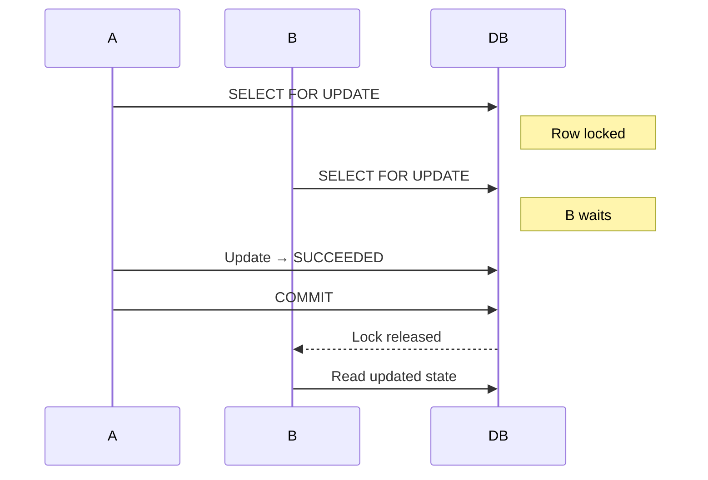
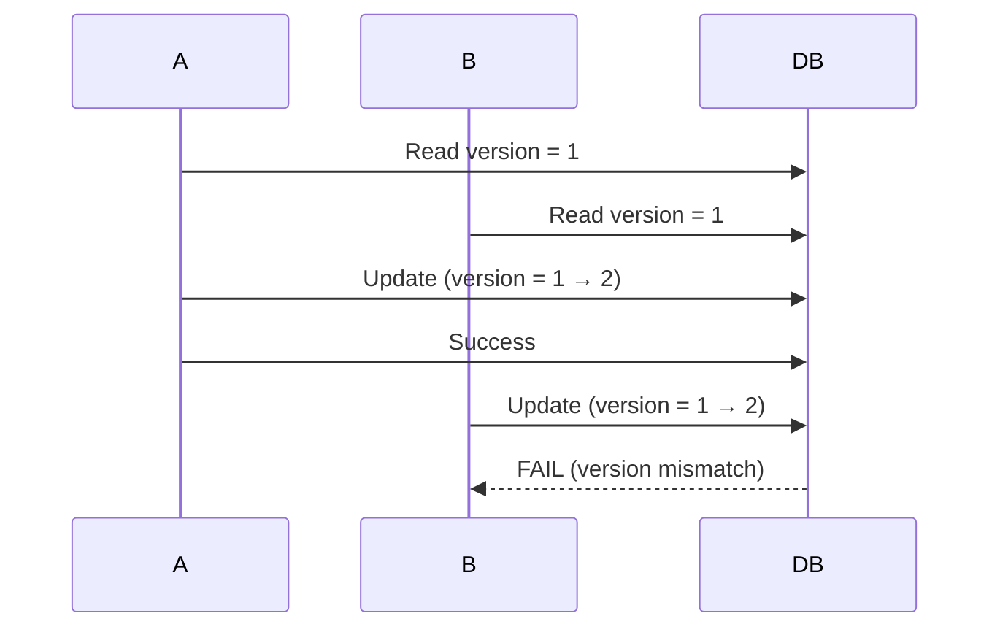

## 1. Why Locking is Needed

---

In the previous article, we saw that **idempotency alone is not enough** when different requests use different keys.

> ❗ Multiple requests can still reach the processing stage at the same time.

Locking ensures:

- only one request **executes business logic**  
- others are **blocked or rejected safely**  

---

## 2. What We Are NOT Repeating

---

Already covered:

- confirm flow  
- idempotency basics  
- state transitions  

👉 This article focuses only on **how locking prevents concurrent execution**.

---

## 3. Two Main Locking Approaches

---

### 1. Pessimistic Locking

Assumes conflict **will happen**, so it prevents it upfront.

---

### 2. Optimistic Locking

Assumes conflict is **rare**, and detects it during update.

---

## 4. Pessimistic Locking

---

### How It Works

```sql
SELECT * FROM payments WHERE id = ? FOR UPDATE;
```

- locks the row  
- other transactions must wait  

---

### Behavior



---

### Advantages

- simple and reliable  
- guarantees single execution  

---

### Disadvantages

- blocking → slower under load  
- risk of deadlocks (if misused)  

---

## 5. Optimistic Locking

---

### How It Works

Uses a `version` field.

```sql
UPDATE payments
SET status = 'PROCESSING', version = version + 1
WHERE id = ? AND version = ?;
```

---

### Behavior

- if version matches → update succeeds  
- if version changed → update fails  

---

### Flow



---

### Advantages

- no blocking  
- better performance under low contention  

---

### Disadvantages

- requires retry logic  
- more complex handling  

---

## 6. Which One Should We Use?

---

### For Payment Systems

👉 **Pessimistic locking is usually preferred**

---

### Why?

- payment execution is critical  
- duplicate execution is unacceptable  
- contention is possible (retries, double clicks)

---

### When Optimistic Locking Can Work

- low contention systems  
- non-critical updates  

---

## 7. Hybrid Approach (Real-World)

---

Many systems combine both:

- pessimistic locking for **critical sections**  
- optimistic locking for **lightweight updates**  

---

## 8. Where Locking is Applied in Our Design

---

During confirm flow:

```text
Fetch + Lock Payment
→ Validate state
→ Update to PROCESSING
```

---

👉 This ensures:

- only one request can transition the state  

---

## 9. Common Mistakes

---

### ❌ No locking

- allows duplicate execution  

---

### ❌ Locking too late

- race condition window  

---

### ❌ Long-running locks

- reduces throughput  

---

### ❌ Locking around external calls

- blocks system unnecessarily  

---

## 10. Best Practices

---

### 1. Lock Early

- acquire lock before state change  

---

### 2. Keep Lock Duration Short

- only DB operations inside lock  

---

### 3. Combine with State Validation

- locking alone is not enough  

---

### 4. Avoid Deadlocks

- lock resources in consistent order  

---

## Conclusion

---

Locking ensures that:

- only one execution path proceeds  
- concurrent requests do not corrupt state  

---

### 🔗 What’s Next?

👉 **[Atomic State Transitions →](/learning/advanced-skills/system-design-practice/intermediate-systems/6_payment-api/8_phase-8/8_4_atomic-state-transitions)**

---

> 📝 **Takeaway**:
>
> - Pessimistic locking is preferred for critical flows  
> - Optimistic locking is useful for performance scenarios  
> - Locking must be combined with validation for correctness
