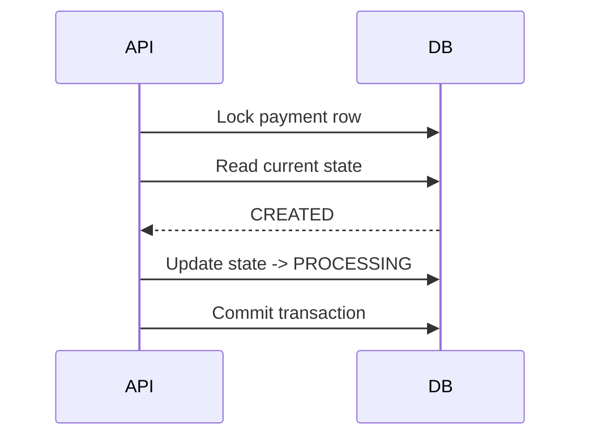

## 1. Why Atomic State Transitions Matter

---

In the previous article, we discussed locking.

Locking helps ensure that only one request can enter a critical section at a time.

But locking alone is not enough.

> ❗ Even with locking, the system must still guarantee that a payment moves only through **valid and atomic state transitions**.

If state changes are not protected properly, the system can still end up in:

- invalid lifecycle states
- duplicate execution paths
- inconsistent business behavior

---

## 2. What This Article Focuses On

---

This article does **not** re-explain:

- the payment lifecycle itself
- the full confirm flow
- idempotency basics

Those were already covered earlier.

👉 Here we focus only on:

- how state transitions must be applied **safely**
- how to prevent invalid or duplicate transitions

---

## 3. What Makes a Transition Atomic?

---

An atomic state transition means:

> The system checks the current state and updates it as **one protected operation**, so no other request can interfere in between.

---

### Example Goal

```text
CREATED → PROCESSING
```

The system must ensure:

- payment is still `CREATED` when transition happens
- no other request changed it in between

---

## 4. Why Simple Check-Then-Update is Dangerous

---

### Unsafe Pattern

```text
1. Read payment status = CREATED
2. Decide to process
3. Update status = PROCESSING
```

---

### What can go wrong?

Two threads can both do:

```text
A reads CREATED
B reads CREATED
A updates to PROCESSING
B also updates to PROCESSING
```

👉 Now both may continue execution.

---

> 📝 **Key Insight:**  
> Reading and updating state separately creates a race window.

---

## 5. Safe Transition Model

---

A correct design uses one or both of these protections:

### 1. Lock + Validate + Update

- lock payment row
- validate current state
- update state

---

### 2. Compare-and-Update

Update only if state still matches expected value.

Example:

```sql
UPDATE payments
SET status = 'PROCESSING'
WHERE id = ? AND status = 'CREATED';
```

If rows affected = 1:

- transition succeeded

If rows affected = 0:

- state was already changed

---

## 6. Valid State Transition Rules

---

For our payment lifecycle:

```text
CREATED → PROCESSING → SUCCEEDED / FAILED
```

---

### Allowed Examples

- `CREATED → PROCESSING`
- `PROCESSING → SUCCEEDED`
- `PROCESSING → FAILED`

---

### Rejected Examples

- `SUCCEEDED → PROCESSING`
- `FAILED → SUCCEEDED` without explicit retry flow
- `PROCESSING → CREATED`

---

👉 State validation must happen before each transition.

---

## 7. Transition Example in Confirm Flow

---

### Goal

Move payment from:

```text
CREATED → PROCESSING
```

---

### Safe Execution



---

### Why this works

- no other request can modify state during lock
- transition is validated before update

---

## 8. Terminal States Must Be Protected

---

Some states should behave as **terminal states**.

### Example

```text
SUCCEEDED
```

Once payment is `SUCCEEDED`:

- no confirm request should re-execute payment
- no transition back to `PROCESSING` should be allowed

---

👉 Terminal states are critical for preventing double execution.

---

## 9. Atomicity + Business Meaning

---

Atomicity is not just technical correctness.

It also protects business meaning.

### Example

If a payment is already `SUCCEEDED`, then:

- business operation is already complete
- any further processing attempt is invalid

So atomic transitions protect both:

- system correctness
- business correctness

---

## 10. Locking vs Atomic Transition

---

These are related, but not identical.

### Locking

- prevents concurrent interference

### Atomic State Transition

- ensures the **right state change** happens safely

---

👉 Good systems use both.

---

## 11. Common Mistakes to Avoid

---

### ❌ Read-then-update without protection

- race window

---

### ❌ Allowing invalid transitions

- breaks lifecycle rules

---

### ❌ Treating all states as mutable

- can re-open completed payments

---

### ❌ Ignoring rows-affected result in compare-and-update

- hides failed transitions

---

## 12. Best Practices

---

### 1. Define allowed transitions explicitly

- do not rely on implicit behavior

---

### 2. Validate state before every critical update

- especially before execution

---

### 3. Protect terminal states

- `SUCCEEDED` must not be reprocessed

---

### 4. Use locking or compare-and-update consistently

- avoid mixed unsafe patterns

---

## Conclusion

---

Atomic state transitions ensure that:

- payments move only through valid states
- concurrent requests cannot corrupt lifecycle
- completed payments are protected from re-execution

---

### 🔗 What’s Next?

👉 **[Protecting Against Double Execution →](/learning/advanced-skills/system-design-practice/intermediate-systems/6_payment-api/8_phase-8/8_5_double-execution-protection)**

---

> 📝 **Takeaway**:
>
> - Locking prevents interference
> - Atomic transitions prevent invalid state changes
> - Both are required for a safe payment lifecycle
