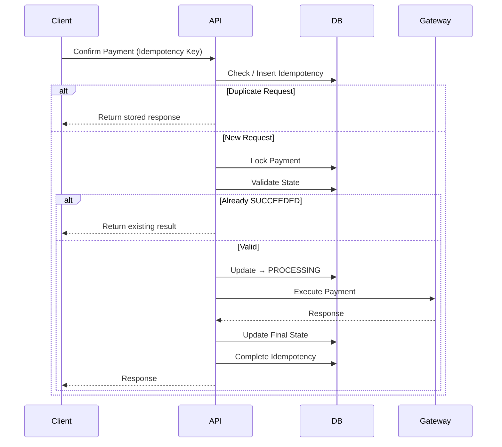

## 1. Why Double Execution is Dangerous

---

In a payment system, the worst possible failure is:

> ❗ **Executing the same payment more than once**

This can lead to:

- double charging customers
- financial loss
- loss of trust

---

## 2. What This Article Focuses On

---

We have already covered:

- idempotency (Phase 5)
- locking (previous article)
- state transitions

👉 This article focuses on **how all of them work together to prevent double execution**.

---

## 3. Where Double Execution Can Happen

---

### 1. Duplicate Requests

```text
Same request sent multiple times
```

---

### 2. Concurrent Requests

```text
Two confirm requests at the same time
```

---

### 3. Retry After Timeout

```text
Client retries while first request may still be running
```

---

### 4. Unknown State Execution

```text
Gateway timeout → retry → execution happens again
```

---

## 4. Layered Defense Model

---

No single mechanism is enough.

👉 We rely on **multiple layers working together**.

---

### Layer 1 — Idempotency (Request Level)

- prevents duplicate requests with same key

---

### Layer 2 — Locking (Execution Level)

- prevents concurrent processing

---

### Layer 3 — State Validation (Business Level)

- ensures payment is in valid state

---

### Layer 4 — Atomic Transitions

- ensures only one valid state change succeeds

---

### Layer 5 — Gateway Protection (Optional)

- external idempotency at payment provider

---

## 5. End-to-End Protection Flow

---



---

## 6. Key Insight

---

> ❗ **Double execution is prevented not by one mechanism, but by multiple checks at different layers.**

---

## 7. Example Scenario Walkthrough

---

### Scenario: Two Requests with Different Keys

```text
A → starts processing
B → arrives concurrently
```

---

### What Happens

1. A locks payment
2. B waits for lock
3. A completes and updates to `SUCCEEDED`
4. B reads updated state
5. B does NOT execute again

---

👉 Double execution prevented.

---

## 8. What Happens If One Layer Fails?

---

### If Idempotency Fails

- locking + state validation still protect

---

### If Locking Fails

- atomic update + state validation may still protect

---

### If State Validation Fails

- system becomes unsafe

---

👉 **State validation is the last line of defense.**

---

## 9. Common Mistakes

---

### ❌ Relying only on idempotency

- fails for different keys

---

### ❌ No state validation

- allows re-processing

---

### ❌ No locking

- allows parallel execution

---

### ❌ Treating timeout as failure

- may cause duplicate execution

---

## 10. Design Principle

---

> 🧠 **Never trust a single safeguard in a payment system. Always layer protections.**

---

## Conclusion

---

Preventing double execution requires:

- request-level safety (idempotency)
- execution-level control (locking)
- state-level correctness (validation)

---

### 🔗 What’s Next?

👉 **[Consistency vs Availability →](/learning/advanced-skills/system-design-practice/intermediate-systems/6_payment-api/8_phase-8/8_6_consistency-vs-availability)**

---

> 📝 **Takeaway**:
>
> - Double execution is prevented through layered safeguards
> - No single mechanism is sufficient
> - Correct systems defend at multiple levels
