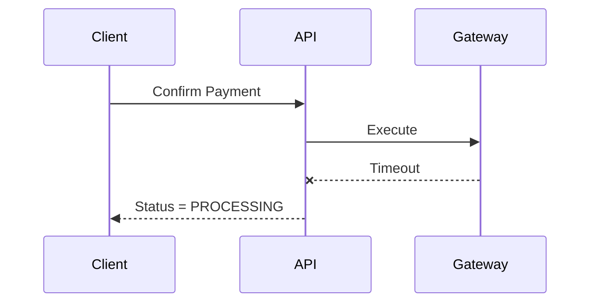

## 1. Why This Topic Matters

---

So far, we ensured:

- no duplicate execution
- safe concurrency handling
- valid state transitions

But now we face a harder problem:

> ❗ _What do we do when we don’t know what happened?_

---

## 2. What This Article Focuses On

---

We are NOT re-explaining:

- idempotency
- locking
- flows

👉 This article focuses on **decision-making under uncertainty**.

---

## 3. The Core Problem: Timeout

---

### Scenario

```text
API → Gateway call

No response received
```

---

### Possible realities

```text
1. Payment succeeded
2. Payment failed
3. Request never reached gateway
```

👉 System does NOT know which one is true.

---

## 4. The Trade-off

---

At this point, system must choose between:

### Option 1 — Strong Consistency

```text
Wait until we know exact result
```

---

### Option 2 — High Availability

```text
Return response immediately (e.g., PROCESSING)
```

---

> 📝 **Key Insight:**  
> In payment systems, we often prefer **correctness over immediacy**.

---

## 5. What We Should NOT Do

---

### ❌ Treat timeout as failure

```text
Mark payment as FAILED immediately
```

---

### Why?

- payment might have actually succeeded
- retry may cause **double execution**

---

## 6. Recommended Approach

---

### Step 1: Move to PROCESSING

```text
payment.status = PROCESSING
```

---

### Step 2: Return Safe Response

```text
Return: "Payment is being processed"
```

---

### Step 3: Resolve Later

Using:

- retry with idempotency
- reconciliation job

---

## 7. System Behavior Model

---



---

👉 System avoids incorrect assumption.

---

## 8. Eventual Consistency

---

At this stage, system is:

```text
Temporarily inconsistent
```

---

But later:

- reconciliation fixes state
- retry confirms result

---

👉 This is **eventual consistency**.

---

## 9. Why This Works for Payments

---

Payment systems prioritize:

### 1. Correctness

- no double charge

---

### 2. Safety

- no wrong state

---

### 3. Recoverability

- system can fix itself later

---

👉 Availability is secondary in this context.

---

## 10. Real-World Design Pattern

---

### Pattern: Accept Uncertainty

Instead of forcing an answer:

```text
Return PROCESSING
```

---

### Pattern: Resolve Asynchronously

```text
Retry / Reconcile / Query Gateway
```

---

## 11. Common Mistakes

---

### ❌ Immediate failure on timeout

- leads to duplicate execution

---

### ❌ Blocking API for long time

- hurts user experience

---

### ❌ Ignoring unknown state

- leads to inconsistent system

---

### ❌ No reconciliation mechanism

- system never recovers

---

## 12. Design Principle

---

> 🧠 **When you are unsure, choose a safe intermediate state instead of a wrong final state.**

---

## Conclusion

---

Consistency vs availability is not theoretical here.

It directly affects:

- correctness
- customer trust

---

### 🔗 What’s Next?

👉 **[Unknown State & Recovery →](/learning/advanced-skills/system-design-practice/intermediate-systems/6_payment-api/8_phase-8/8_7_unknown-state-and-recovery)**

---

> 📝 **Takeaway**:
>
> - Never assume outcome on timeout
> - Use PROCESSING as safe state
> - Resolve uncertainty asynchronously
> - Prioritize correctness over immediacy
