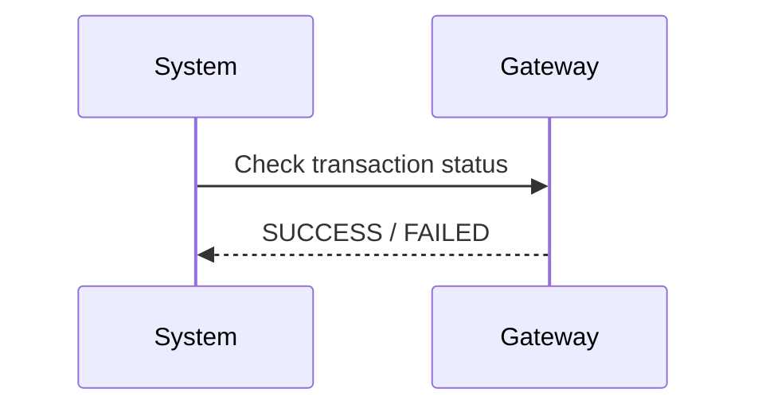
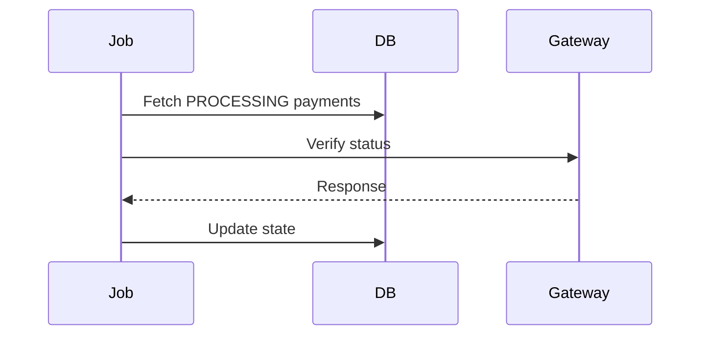

## 1. Why Unknown State is the Hardest Problem

---

In the previous article, we saw that timeouts create uncertainty.

Now we go one step deeper.

> ❗ The hardest problem in payment systems is not failure — it is **unknown state**.

---

## 2. What is an Unknown State?

---

An unknown state occurs when:

```text
System cannot determine if payment succeeded or failed
```

---

### Example

```text
Gateway call made
No response received
```

Possible realities:

- payment succeeded  
- payment failed  
- request never reached gateway  

👉 All are possible, but system knows none.

---

## 3. What We Are NOT Repeating

---

We already covered:

- timeout handling  
- PROCESSING state usage  
- idempotency basics  

👉 This article focuses on **how to recover from unknown state**.

---

## 4. Core Principle

---

> 🧠 **Never guess the outcome. Always verify.**

---

This is the foundation of recovery design.

---

## 5. Recovery Strategies

---

There are three primary approaches.

---

### 1. Retry with Idempotency

---

```text
Retry same request with same idempotency key
```

---

### Why this works

- prevents duplicate execution  
- ensures safe re-processing  

---

### When to use

- transient failures  
- uncertain execution state  

---

## 6. Strategy 2 — Query the Gateway

---

If gateway supports it:

```text
Check payment status using gateway_reference
```

---

### Flow



---

### Benefit

- authoritative answer from external system  

---

## 7. Strategy 3 — Reconciliation Job

---

When immediate resolution is not possible.

---

### Background Process

```text
Scan payments in PROCESSING
Verify status with gateway
Update final state
```

---

### Flow



---

## 8. Recovery Decision Tree

---

```text
Timeout occurs

→ Can retry safely?
   YES → Retry with idempotency

→ Can query gateway?
   YES → Fetch status

→ Otherwise
   → Reconciliation job handles later
```

---

## 9. Designing for Recovery

---

To support recovery, system must:

### 1. Store Gateway Reference

- enables external lookup  

---

### 2. Track PROCESSING State

- identifies incomplete operations  

---

### 3. Store Attempts

- helps debug and retry  

---

### 4. Use Idempotency

- ensures retries are safe  

---

## 10. Real-World Insight

---

In production systems:

- unknown states are common  
- recovery is expected behavior  

---

👉 Systems are designed to **eventually reach correctness**, not instantly.

---

## 11. Common Mistakes

---

### ❌ Guessing outcome

- leads to incorrect state  

---

### ❌ Immediate failure marking

- causes duplicate execution later  

---

### ❌ No reconciliation

- stuck payments remain unresolved  

---

### ❌ Not storing gateway reference

- cannot verify externally  

---

## 12. Design Principle

---

> 🧠 **A good system does not avoid uncertainty — it is designed to recover from it.**

---

## Conclusion

---

Unknown state handling ensures that:

- system remains correct under uncertainty  
- payments eventually reach final state  
- no incorrect assumptions are made  

---

### 🔗 What’s Next?

👉 **[Common Race Conditions & Anti-Patterns →](/learning/advanced-skills/system-design-practice/intermediate-systems/6_payment-api/8_phase-8/8_8_common-race-conditions)**

---

> 📝 **Takeaway**:
>
> - Unknown state is unavoidable  
> - Never assume outcome — always verify  
> - Use retries, gateway checks, and reconciliation  
> - Design systems to recover, not just execute
