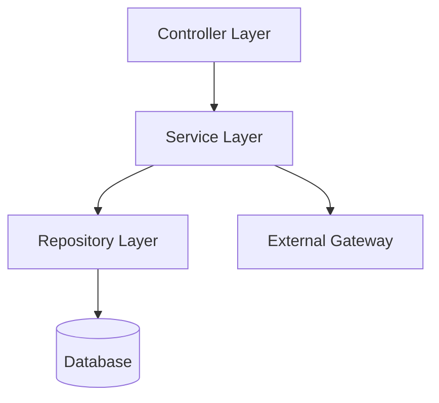

## 1. Why Layered Architecture Matters

---

In the previous article, we introduced the idea of a layered backend.

Now we define it properly.

> 🧠 **Good system design fails without good code structure.**

A layered architecture ensures:

- separation of concerns
- maintainability
- testability
- scalability of codebase

---

## 2. What This Article Focuses On

---

We are NOT re-explaining:

- system design flows
- idempotency concepts
- concurrency strategies

👉 This article focuses on:

- how to structure backend code
- how responsibilities are divided across layers

---

## 3. High-Level Layered Structure

---



---

### Interpretation

- **Controller** receives HTTP requests and delegates work
- **Service** contains the main business logic and orchestration
- **Repository** handles persistence and database access
- **External Gateway** is called by the **Service layer**, not by the Controller or Repository

👉 This is important because the **Service layer becomes the coordination point** between internal persistence and external payment execution.

---

## 4. Layer Responsibilities

---

### 1. Controller Layer

---

Handles:

- HTTP requests/responses
- input validation (basic)
- mapping request → service calls

---

### What it should NOT do

- business logic
- DB access
- complex validations

---

### Example (Spring Boot)

```java
@RestController
@RequestMapping("/payments")
public class PaymentController {

    private final PaymentService paymentService;

    public PaymentController(PaymentService paymentService) {
        this.paymentService = paymentService;
    }

    @PostMapping
    public ResponseEntity<CreatePaymentResponse> createPayment(
            @RequestBody CreatePaymentRequest request,
            @RequestHeader("Idempotency-Key") String key) {

        return ResponseEntity.ok(
                paymentService.createPayment(request, key)
        );
    }
}
```

---

## 5. Service Layer (Core of System)

---

This is the **most important layer**.

Handles:

- business logic
- idempotency handling
- concurrency control
- state transitions
- orchestration of flow

---

### Example

```java
@Service
public class PaymentService {

    private final PaymentRepository paymentRepository;
    private final IdempotencyService idempotencyService;

    public CreatePaymentResponse createPayment(CreatePaymentRequest request, String key) {

        Optional<IdempotencyRecord> existing = idempotencyService.find(key);

        if (existing.isPresent()) {
            return existing.get().getResponse();
        }

        idempotencyService.reserve(key);

        Payment payment = new Payment(...);
        paymentRepository.save(payment);

        idempotencyService.complete(key, payment.getId());

        return new CreatePaymentResponse(payment.getId());
    }
}
```

---

### What Service SHOULD NOT do

- handle HTTP details
- directly construct SQL queries

---

## 6. Repository Layer

---

Handles:

- database interaction
- CRUD operations
- query execution

---

### Example

```java
@Repository
public interface PaymentRepository extends JpaRepository<Payment, UUID> {

    Optional<Payment> findByOrderId(String orderId);
}
```

---

### What Repository SHOULD NOT do

- business logic
- flow orchestration

---

## 7. Gateway Layer (External Integration)

---

Handles:

- interaction with external payment providers

---

### Example

```java
@Component
public class PaymentGatewayClient {

    public GatewayResponse charge(Payment payment) {
        // call external API
        return new GatewayResponse(...);
    }
}
```

---

### Why separate this?

- allows multiple providers (Stripe, Adyen, etc.)
- easier testing and mocking

---

## 8. Dependency Flow

---

```text
Controller → Service → Repository
                 ↓
           Gateway Client
```

---

### Important Rule

> ❗ **Dependencies should flow downward only.**

---

### ❌ Bad Design

- Repository calling Service
- Controller calling Repository directly

---

### ✅ Good Design

- Controller → Service
- Service → Repository

---

## 9. Suggested Package Structure (Java)

---

```text
com.payment

├── controller
│   └── PaymentController
│
├── service
│   └── PaymentService
│
├── repository
│   └── PaymentRepository
│
├── domain
│   └── Payment
│
├── dto
│   ├── request
│   └── response
│
├── gateway
│   └── PaymentGatewayClient
│
├── idempotency
│   └── IdempotencyService
```

---

## 10. Why This Architecture Works

---

### 1. Separation of Concerns

- each layer has clear responsibility

---

### 2. Testability

- service can be tested independently

---

### 3. Flexibility

- change DB or gateway without breaking system

---

### 4. Readability

- easy to understand code flow

---

## 11. Common Mistakes

---

### ❌ Fat Controllers

- business logic in controller

---

### ❌ Fat Repositories

- business logic inside queries

---

### ❌ God Service

- everything dumped into one class

---

### ❌ Tight Coupling

- hard-coded dependencies

---

## 12. Design Principle

---

> 🧠 **Structure determines maintainability.**

---

Clean architecture ensures that:

- changes are localized
- system remains understandable

---

## Conclusion

---

Layered architecture provides:

- clarity in design
- maintainability
- scalability of codebase

---

### 🔗 What’s Next?

👉 **[Create Payment Implementation →](/learning/advanced-skills/system-design-practice/intermediate-systems/6_payment-api/9_phase-9/9_3_create-payment-implementation)**

---

> 📝 **Takeaway**:
>
> - Controller handles HTTP
> - Service handles logic
> - Repository handles DB
> - Gateway handles external calls
> - Clean separation is critical for real systems
