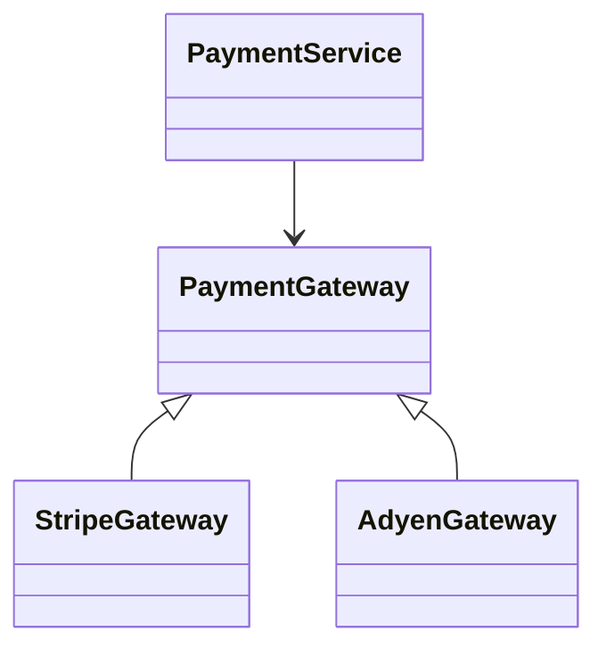

## 1. Why This Article

---

In the confirm flow, we introduced an external call:

```text
Payment → External Gateway (Stripe / Adyen / etc.)
```

This introduces a major design concern:

> ❗ **External systems are unreliable, variable, and change over time.**

---

## 2. What This Article Focuses On

---

We are NOT re-explaining:

- confirm flow
- concurrency

👉 This article focuses on:

- how to design a clean abstraction for external gateways
- how to support multiple providers
- how to keep service layer clean

---

## 3. Problem Without Abstraction

---

### ❌ Bad Design

```java
if (provider.equals("STRIPE")) {
    // Stripe API call
} else if (provider.equals("ADYEN")) {
    // Adyen API call
}
```

---

### Problems

- tightly coupled logic
- hard to extend
- difficult to test

---

## 4. Goal of Gateway Abstraction

---

> 🧠 **Decouple business logic from external integrations.**

---

We want:

- pluggable gateway implementations
- clean service layer
- easy testing (mocking)

---

## 5. Core Design (Strategy Pattern)

---

We use a **strategy pattern**.



---

## 6. Gateway Interface

---

```java
public interface PaymentGateway {

    GatewayResponse charge(Payment payment);
}
```

---

👉 Defines a common contract.

---

## 7. Concrete Implementations

---

### Stripe

```java
@Component
public class StripeGateway implements PaymentGateway {

    @Override
    public GatewayResponse charge(Payment payment) {
        // call Stripe API
        return new GatewayResponse(true);
    }
}
```

---

### Adyen

```java
@Component
public class AdyenGateway implements PaymentGateway {

    @Override
    public GatewayResponse charge(Payment payment) {
        // call Adyen API
        return new GatewayResponse(true);
    }
}
```

---

## 8. Gateway Resolver (Factory)

---

We need a way to select the correct gateway.

---

```java
@Component
public class GatewayResolver {

    private final Map<String, PaymentGateway> gateways;

    public GatewayResolver(List<PaymentGateway> gatewayList) {
        this.gateways = gatewayList.stream()
                .collect(Collectors.toMap(
                        g -> g.getClass().getSimpleName(),
                        g -> g
                ));
    }

    public PaymentGateway resolve(String provider) {
        PaymentGateway gateway = gateways.get(provider);

        if (gateway == null) {
            throw new IllegalArgumentException("Unsupported provider");
        }

        return gateway;
    }
}
```

---

👉 Spring injects all implementations automatically.

---

## 9. Using in Service Layer

---

```java
@Service
public class PaymentService {

    private final GatewayResolver gatewayResolver;

    public GatewayResponse callGateway(Payment payment) {

        PaymentGateway gateway = gatewayResolver.resolve(payment.getProvider());

        return gateway.charge(payment);
    }
}
```

---

👉 Service is now clean and provider-agnostic.

---

## 10. Benefits of This Design

---

### 1. Extensibility

Add new provider:

```java
class PaypalGateway implements PaymentGateway
```

👉 No change in service layer.

---

### 2. Testability

```java
@Mock PaymentGateway gateway;
```

👉 Easy unit testing.

---

### 3. Maintainability

- changes isolated to implementation

---

### 4. Clean Code

- no if-else logic

---

## 11. Advanced Considerations

---

### 1. Timeouts & Retries

- wrap gateway calls with retry logic

---

### 2. Circuit Breaker

- prevent cascading failures

---

### 3. Logging & Metrics

- track success/failure rates

---

### 4. Idempotency at Gateway Level

- some providers support idempotency keys

---

## 12. Common Mistakes

---

### ❌ Hardcoding providers in service

---

### ❌ Mixing business logic with API calls

---

### ❌ No abstraction layer

---

### ❌ Not handling failures

---

## 13. Design Insight

---

> 🧠 **External systems should always be behind an abstraction boundary.**

---

This ensures:

- flexibility
- resilience
- maintainability

---

## Conclusion

---

Gateway abstraction allows you to:

- integrate multiple providers cleanly
- isolate external dependencies
- keep business logic simple

---

### 🔗 What’s Next?

👉 **[Phase 10: Security, Access Control & Compliance →](/learning/advanced-skills/system-design-practice/intermediate-systems/6_payment-api/10_phase-10/10_1_overview)**

---

> 📝 **Takeaway**:
>
> - Use strategy pattern for gateway abstraction
> - Keep service layer provider-agnostic
> - Add new gateways without modifying core logic
> - External systems must be isolated behind clean interfaces
